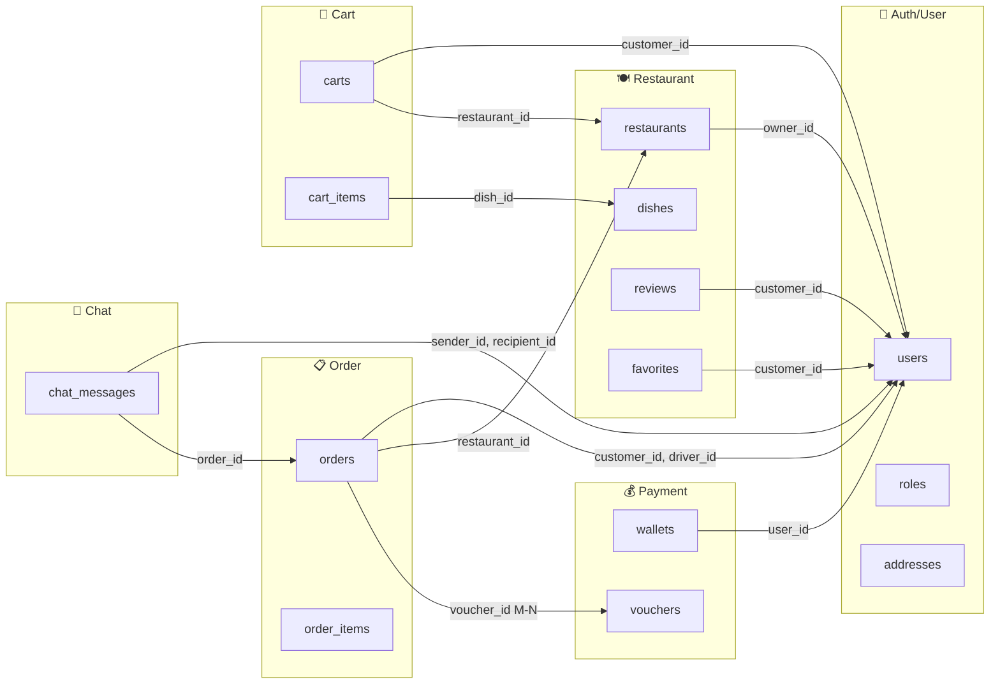

# Phân tích Database Eatzy để tách theo Domain (Bước 2)

## Tổng quan
Hệ thống `eatzy_backend` hiện có **30 bảng (entities)**. Dưới đây là bản phân tích nhóm các bảng theo domain và xác định các mối quan hệ **xuyên domain (cross-domain)** cần xử lý.

---

## Phân nhóm bảng theo Domain

### 🔐 Domain 1: Auth/User Service
| Bảng | Mô tả |
|---|---|
| `users` | Thông tin người dùng (customer, driver, owner) |
| `roles` | Vai trò (CUSTOMER, DRIVER, ADMIN...) |
| `permissions` | Quyền hạn |
| `email_verifications` | Xác thực email |
| `customer_profiles` | Hồ sơ khách hàng |
| `driver_profiles` | Hồ sơ tài xế |
| `addresses` | Địa chỉ của khách hàng |

### 🍽️ Domain 2: Restaurant Service
| Bảng | Mô tả |
|---|---|
| `restaurants` | Thông tin nhà hàng |
| `restaurant_types` | Loại nhà hàng |
| `restaurant_restaurant_type` | Bảng liên kết (M-N) |
| `dishes` | Món ăn |
| `dish_categories` | Danh mục món ăn |
| `menu_options` | Tùy chọn món (size, topping...) |
| `menu_option_groups` | Nhóm tùy chọn |
| `favorites` | Nhà hàng yêu thích |
| `reviews` | Đánh giá nhà hàng |
| `user_restaurant_scores` | Điểm gợi ý nhà hàng cho user |
| `user_type_scores` | Điểm gợi ý loại nhà hàng |

### 📋 Domain 3: Order Service
| Bảng | Mô tả |
|---|---|
| `orders` | Đơn hàng |
| `order_items` | Chi tiết đơn hàng |
| `order_item_options` | Tùy chọn trong chi tiết đơn hàng |
| `order_earnings_summary` | Tổng hợp thu nhập từ đơn hàng |

### 🛒 Domain 4: Cart Service
| Bảng | Mô tả |
|---|---|
| `carts` | Giỏ hàng |
| `cart_items` | Món trong giỏ |
| `cart_item_options` | Tùy chọn món trong giỏ |

### 💰 Domain 5: Payment/Wallet Service
| Bảng | Mô tả |
|---|---|
| `wallets` | Ví tiền |
| `wallet_transactions` | Lịch sử giao dịch |
| `vouchers` | Mã giảm giá |
| `voucher_restaurant` | Bảng liên kết voucher-restaurant (M-N) |
| `voucher_order` | Bảng liên kết voucher-order (M-N) |

### 💬 Domain 6: Chat/Notification Service
| Bảng | Mô tả |
|---|---|
| `chat_messages` | Tin nhắn chat |

### 📊 Domain 7: Report/Analytics Service
| Bảng | Mô tả |
|---|---|
| `monthly_revenue_reports` | Báo cáo doanh thu hàng tháng |

### ⚙️ Domain 8: System Config (giữ trong Monolith)
| Bảng | Mô tả |
|---|---|
| `system_configuration` | Cấu hình hệ thống |

---

## Các quan hệ xuyên Domain (Cross-Domain Relationships)

> [!CAUTION]
> Đây là các mối quan hệ **JOIN giữa các domain khác nhau** — chính là phần khó nhất cần xử lý khi tách microservice.



### Chi tiết các quan hệ cần xử lý

| Quan hệ | Từ Entity | Tới Entity | Kiểu | Mức độ khó |
|---|---|---|---|---|
| `orders.customer_id` → `users.id` | Order | User | ManyToOne | ⚠️ Cao |
| `orders.driver_id` → `users.id` | Order | User | ManyToOne | ⚠️ Cao |
| `orders.restaurant_id` → `restaurants.id` | Order | Restaurant | ManyToOne | ⚠️ Cao |
| `voucher_order` (M-N) | Order | Voucher | ManyToMany | ⚠️ Cao |
| `restaurants.owner_id` → `users.id` | Restaurant | User | ManyToOne | 🟡 Trung bình |
| `carts.customer_id` → `users.id` | Cart | User | ManyToOne | 🟡 Trung bình |
| `carts.restaurant_id` → `restaurants.id` | Cart | Restaurant | ManyToOne | 🟡 Trung bình |
| `reviews.customer_id` → `users.id` | Review | User | ManyToOne | 🟢 Thấp |
| `favorites.customer_id` → `users.id` | Favorite | User | ManyToOne | 🟢 Thấp |
| `wallets.user_id` → `users.id` | Wallet | User | OneToOne | 🟢 Thấp |
| `chat_messages.sender_id/recipient_id` → `users.id` | Chat | User | ManyToOne | 🟢 Thấp |
| `chat_messages.order_id` → `orders.id` | Chat | Order | ManyToOne | 🟢 Thấp |

---

## Chiến lược xử lý các quan hệ xuyên domain

Khi tách thành microservices, các `@ManyToOne` và `@ManyToMany` xuyên domain phải được thay thế bằng:

1. **Lưu ID thay vì quan hệ JPA trực tiếp:**
   ```java
   // ❌ Trước (Monolith) - JOIN trực tiếp
   @ManyToOne
   @JoinColumn(name = "customer_id")
   private User customer;

   // ✅ Sau (Microservice) - Chỉ lưu ID
   @Column(name = "customer_id")
   private Long customerId;
   ```

2. **Gọi REST API nội bộ hoặc Event-driven** để lấy thông tin từ service khác khi cần.

---

## Thứ tự tách đề xuất

| Thứ tự | Service | Lý do |
|---|---|---|
| 1 | **Auth/User Service** | Nền tảng, mọi service đều cần user info |
| 2 | **Restaurant Service** | Ít phụ thuộc ngược, dữ liệu tĩnh |
| 3 | **Cart Service** | Scope nhỏ, dễ tách |
| 4 | **Order Service** | Phức tạp nhất, nhiều cross-domain |
| 5 | **Payment/Wallet** | Gắn chặt với Order |
| 6 | **Chat Service** | Hoàn toàn độc lập |
| 7 | **Report Service** | Có thể đọc dữ liệu từ các service khác |
