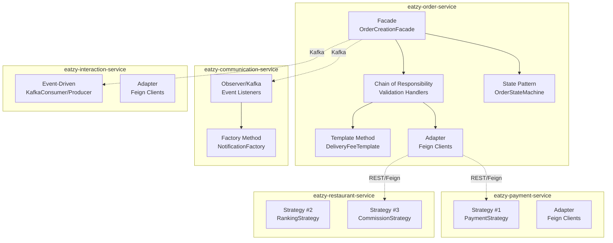
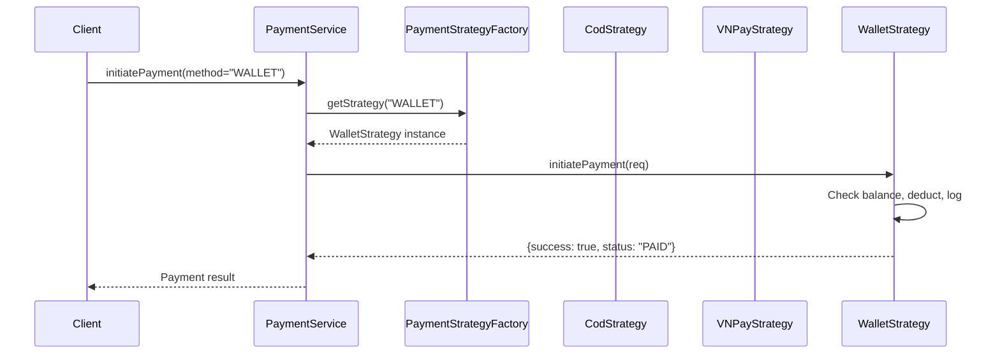
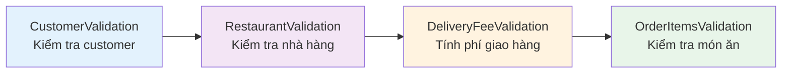
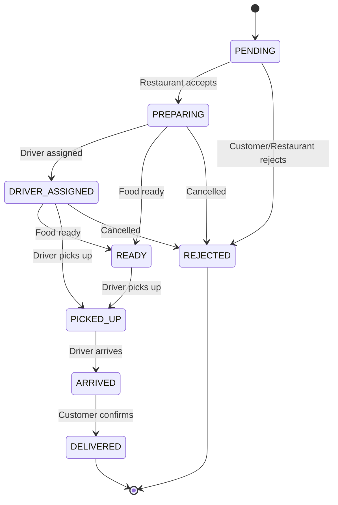
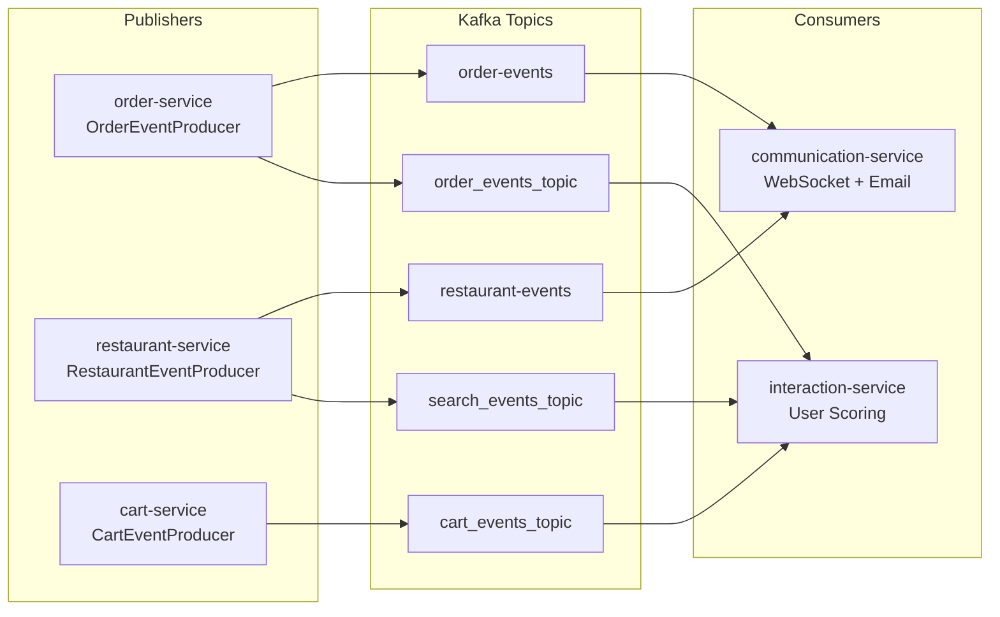
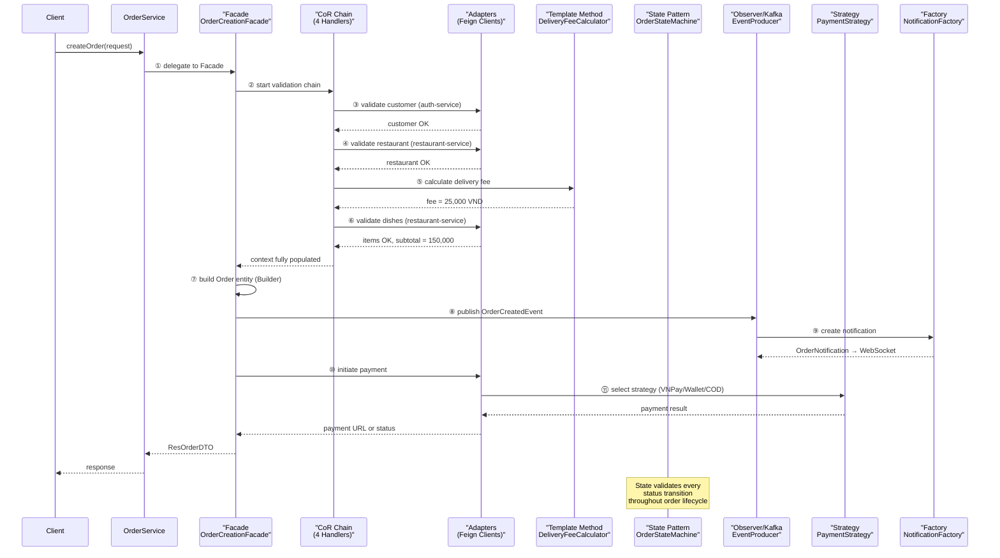

# 📐 Eatzy Microservices — Tài Liệu Design Patterns Toàn Diện

> Tài liệu này phân tích **tất cả Design Patterns** được sử dụng trong hệ thống **Eatzy Microservices**, bao gồm giải thích chi tiết ý nghĩa từng file, từng hàm, từng dòng code, lý do sử dụng, lợi ích khi mở rộng, và sự cộng tác giữa các thành phần.

---

## 📑 Mục Lục

| # | Design Pattern | Service(s) | Mục đích chính |
|---|---|---|---|
| 1 | [**Strategy Pattern**](#1-strategy-pattern-⭐-trọng-tâm) | Payment, Restaurant (×2) | Thay đổi thuật toán lúc runtime |
| 2 | [**Adapter Pattern**](#2-adapter-pattern) | Order, Payment, Interaction | Giao tiếp giữa các microservice |
| 3 | [**Chain of Responsibility**](#3-chain-of-responsibility-pattern) | Order | Chuỗi validation tuần tự |
| 4 | [**Facade Pattern**](#4-facade-pattern) | Order | Điều phối quy trình phức tạp |
| 5 | [**State Pattern**](#5-state-pattern) | Order | Quản lý trạng thái đơn hàng |
| 6 | [**Template Method Pattern**](#6-template-method-pattern) | Order | Khung tính phí giao hàng |
| 7 | [**Observer / Event-Driven**](#7-observer--event-driven-pattern) | Order, Restaurant, Interaction, Communication | Pub/Sub qua Kafka |
| 8 | [**Factory Method Pattern**](#8-factory-method-pattern) | Communication | Tạo notification đa loại |

---

## Tổng Quan Kiến Trúc



---

## 1. Strategy Pattern ⭐ (TRỌNG TÂM)

> **Định nghĩa**: Strategy Pattern cho phép định nghĩa **một nhóm thuật toán**, đóng gói mỗi thuật toán lại, và cho phép **hoán đổi linh hoạt** lúc runtime mà không cần thay đổi client code.

> [!IMPORTANT]
> Trong Eatzy có **3 nơi** sử dụng Strategy Pattern, mỗi nơi giải quyết một bài toán khác nhau. Dưới đây phân tích **cả 3 nơi chi tiết**.

---

### 1.1. Strategy #1 — Payment Strategy (eatzy-payment-service)

**Bài toán**: Eatzy hỗ trợ nhiều phương thức thanh toán (COD, VNPay, Wallet). Mỗi phương thức có logic xử lý hoàn toàn khác nhau. Nếu dùng `if-else`, code sẽ dài và khó bảo trì.

#### 📁 File 1: [PaymentStrategy.java](file:///c:/Source%20Code/Java/eatzy/eatzy-microservices/eatzy-payment-service/src/main/java/com/eatzy/payment/designpattern/strategy/PaymentStrategy.java)

**Vai trò**: Interface (hợp đồng) — Định nghĩa "hình dáng" chung mà MỌI phương thức thanh toán phải tuân theo.

```java
// Dòng 7: Khai báo interface — đây là "bản thiết kế" chung
public interface PaymentStrategy {

    // Dòng 8: Hàm khởi tạo thanh toán — nhận request, trả kết quả
    // Tại sao trả Map<String, Object>? Vì mỗi phương thức trả kết quả khác nhau:
    //   - VNPay trả paymentUrl (redirect)
    //   - Wallet trả status "PAID" (trừ tiền trực tiếp)
    //   - COD trả valid=true (chỉ validate)
    Map<String, Object> initiatePayment(ReqPaymentInitiateDTO req) throws Exception;

    // Dòng 10: Hàm xử lý callback — chỉ VNPay cần (redirect về từ cổng thanh toán)
    // COD và Wallet sẽ throw UnsupportedOperationException
    Map<String, Object> processCallback(Map<String, String> queryParams) throws Exception;
}
```

**Ý nghĩa**: Interface này là "điểm trừu tượng" — `PaymentService` chỉ cần gọi `strategy.initiatePayment(req)` mà không cần biết bên trong xử lý COD, VNPay hay Wallet. Đây chính là nguyên tắc **"Program to Interface, not Implementation"**.

---

#### 📁 File 2: [PaymentStrategyFactory.java](file:///c:/Source%20Code/Java/eatzy/eatzy-microservices/eatzy-payment-service/src/main/java/com/eatzy/payment/designpattern/strategy/PaymentStrategyFactory.java)

**Vai trò**: Factory — Chọn đúng strategy dựa trên tên phương thức thanh toán.

```java
@Component // Dòng 8: Spring quản lý singleton — chỉ tạo 1 instance duy nhất
public class PaymentStrategyFactory {

    // Dòng 11: Spring tự inject tất cả bean implement PaymentStrategy
    // Key = tên bean (@Component("COD"), @Component("VNPAY"), @Component("WALLET"))
    // Value = instance tương ứng
    // → Map sẽ là: {"COD": CodStrategy, "VNPAY": VNPayStrategy, "WALLET": WalletStrategy}
    private final Map<String, PaymentStrategy> strategies;

    // Dòng 13: Constructor Injection — Spring tự động truyền map vào
    public PaymentStrategyFactory(Map<String, PaymentStrategy> strategies) {
        this.strategies = strategies;
    }

    // Dòng 17-28: Hàm lõi — nhận method name, trả strategy tương ứng
    public PaymentStrategy getStrategy(String method) throws IdInvalidException {
        // Dòng 18-20: Guard clause — kiểm tra input rỗng
        if (method == null || method.trim().isEmpty()) {
            throw new IdInvalidException("Payment method is required");
        }
        
        // Dòng 22: Tra cứu strategy theo key (đã uppercase để khớp tên bean)
        PaymentStrategy strategy = strategies.get(method.toUpperCase());
        
        // Dòng 23-25: Nếu không tìm thấy → lỗi
        if (strategy == null) {
            throw new IdInvalidException("Unsupported payment method: " + method);
        }
        
        return strategy; // Trả đúng strategy cần thiết
    }
}
```

**Tại sao dùng Factory ở đây?** Thay vì viết `if("COD") ... else if("VNPAY") ...`, Factory dùng Map lookup — **O(1) performance**, dễ thêm mới (chỉ cần tạo class mới với `@Component("MOMO")`, không cần sửa Factory).

---

#### 📁 File 3: [CodStrategy.java](file:///c:/Source%20Code/Java/eatzy/eatzy-microservices/eatzy-payment-service/src/main/java/com/eatzy/payment/designpattern/strategy/CodStrategy.java)

**Vai trò**: Concrete Strategy — Xử lý thanh toán khi giao hàng (Cash on Delivery).

```java
@Component("COD") // Dòng 13: Đăng ký bean với tên "COD" → Factory sẽ tìm thấy
public class CodStrategy implements PaymentStrategy {

    // Dòng 17-18: Inject Adapter để gọi auth-service và system-config-service
    private final AuthServiceClient authServiceClient;           // Lấy thông tin driver
    private final SystemConfigServiceClient systemConfigServiceClient; // Lấy COD limit

    @Override
    public Map<String, Object> initiatePayment(ReqPaymentInitiateDTO req) throws Exception {
        Map<String, Object> result = new HashMap<>();

        BigDecimal totalAmount = req.getAmount();
        Long driverId = req.getDriverId();

        // Dòng 35: Lấy giới hạn COD từ system config (mặc định 5,000,000 VND)
        // → Nếu system-config-service down, dùng fallback 5 triệu
        BigDecimal codLimit = getSystemConfigValue("DEFAULT_COD_LIMIT", new BigDecimal("5000000"));

        // Dòng 37-49: Nếu đã có driver, lấy COD limit riêng của driver đó
        // → Mỗi driver có thể có limit khác nhau dựa trên xếp hạng
        if (driverId != null) {
            Map<String, Object> profileResponse = authServiceClient.getDriverProfileByUserId(driverId);
            // ... lấy codLimit từ profile
        }

        // Dòng 51-63: So sánh totalAmount vs codLimit
        if (totalAmount.compareTo(codLimit) > 0) {
            result.put("success", false);   // Từ chối — đơn vượt quá giới hạn COD
            result.put("message", "Order amount exceeds COD limit");
        } else {
            result.put("success", true);    // Chấp nhận — COD hợp lệ
            result.put("redirect", false);  // Không cần redirect (khác VNPay)
        }
        return result;
    }

    @Override
    public Map<String, Object> processCallback(Map<String, String> queryParams) throws Exception {
        // Dòng 80: COD không có callback — tiền trả mặt khi nhận hàng
        throw new UnsupportedOperationException("COD payment does not support callback");
    }
}
```

**Logic nghiệp vụ COD**: Chỉ cần validate giới hạn tiền mặt → không trừ tiền → chờ driver thu tiền khi giao.

---

#### 📁 File 4: [VNPayStrategy.java](file:///c:/Source%20Code/Java/eatzy/eatzy-microservices/eatzy-payment-service/src/main/java/com/eatzy/payment/designpattern/strategy/VNPayStrategy.java)

**Vai trò**: Concrete Strategy — Tích hợp cổng thanh toán VNPay (redirect-based).

```java
@Component("VNPAY") // Đăng ký với Factory
public class VNPayStrategy implements PaymentStrategy {

    private final VNPayConfiguration vnPayConfig;     // Config: tmnCode, hashSecret, returnUrl
    private final OrderServiceClient orderServiceClient; // Gọi order-service để update status

    @Override
    public Map<String, Object> initiatePayment(ReqPaymentInitiateDTO req) throws Exception {
        // Dòng 37: amount × 100 vì VNPay yêu cầu đơn vị nhỏ nhất (VND × 100)
        long amountInt = amount.longValue() * 100;

        // Dòng 39-59: Xây dựng bộ tham số theo spec VNPay 2.1.0
        Map<String, String> vnp_Params = new HashMap<>();
        vnp_Params.put("vnp_Version", "2.1.0");        // Version API
        vnp_Params.put("vnp_Command", "pay");           // Lệnh thanh toán
        vnp_Params.put("vnp_TmnCode", vnPayConfig.getTmnCode()); // Mã terminal
        vnp_Params.put("vnp_Amount", String.valueOf(amountInt));  // Số tiền
        vnp_Params.put("vnp_TxnRef", orderId + "_" + randomNumber); // Mã giao dịch unique
        vnp_Params.put("vnp_ReturnUrl", vnPayConfig.getReturnUrl()); // URL callback
        // ... thêm vnp_CreateDate, vnp_ExpireDate (15 phút)

        // Dòng 61-84: Tạo chữ ký bảo mật (HMAC-SHA512)
        // Sắp xếp params theo thứ tự alphabet → hash → tạo URL
        String vnp_SecureHash = VNPayUtil.hmacSHA512(vnPayConfig.getHashSecret(), hashData);
        String paymentUrl = vnPayConfig.getUrl() + "?" + queryUrl + "&vnp_SecureHash=" + vnp_SecureHash;

        // Dòng 87-91: Trả kết quả — client sẽ redirect user tới paymentUrl
        result.put("success", true);
        result.put("redirect", true);          // ← Khác COD: cần redirect
        result.put("paymentUrl", paymentUrl);  // ← Khác Wallet: có URL
        return result;
    }

    @Override
    public Map<String, Object> processCallback(Map<String, String> queryParams) throws Exception {
        // Dòng 95-153: VNPay gọi ngược lại khi user thanh toán xong
        // 1. Xác minh chữ ký (chống giả mạo)
        // 2. Nếu responseCode == "00" → Thành công → Cập nhật order paymentStatus = "PAID"
        // 3. Nếu không → Thanh toán thất bại
    }
}
```

**So sánh với COD**: VNPay phức tạp hơn nhiều — cần tạo URL, chữ ký bảo mật, xử lý callback. Nhưng nhờ Strategy Pattern, `PaymentService` không cần biết những phức tạp này.

---

#### 📁 File 5: [WalletStrategy.java](file:///c:/Source%20Code/Java/eatzy/eatzy-microservices/eatzy-payment-service/src/main/java/com/eatzy/payment/designpattern/strategy/WalletStrategy.java)

**Vai trò**: Concrete Strategy — Thanh toán qua ví điện tử nội bộ.

```java
@Component("WALLET")
public class WalletStrategy implements PaymentStrategy {

    // Dòng 23-26: Inject 4 service cần thiết
    private final WalletService walletService;                    // Quản lý ví
    private final WalletTransactionService walletTransactionService; // Ghi log giao dịch
    private final AuthServiceClient authServiceClient;            // Tìm admin ID
    private final OrderServiceClient orderServiceClient;          // Cập nhật đơn hàng

    @Override
    @Transactional // Dòng 51: Đảm bảo atomic — nếu lỗi thì rollback toàn bộ
    public Map<String, Object> initiatePayment(ReqPaymentInitiateDTO req) throws Exception {
        // Dòng 63: Lấy ví của customer
        Wallet customerWallet = walletService.getWalletByUserId(customerId);

        // Dòng 68-71: Kiểm tra số dư — nếu không đủ thì từ chối
        if (customerWallet.getBalance().compareTo(totalAmount) < 0) {
            result.put("success", false);
            result.put("message", "Insufficient wallet balance");
            return result;
        }

        // Dòng 74-84: Tạo giao dịch TRỪ TIỀN cho customer
        WalletTransaction customerTransaction = WalletTransaction.builder()
                .wallet(customerWallet)
                .transactionType(TransactionType.PAYMENT)
                .amount(totalAmount.negate())                          // Số âm = trừ tiền
                .balanceAfter(customerWallet.getBalance().subtract(totalAmount)) // Số dư sau giao dịch
                .description("Payment for order #" + orderId)
                .build();
        walletTransactionService.createWalletTransaction(customerTransaction);

        // Dòng 86-101: Tạo giao dịch CỘNG TIỀN cho admin (nền tảng)
        // Admin wallet = ví của Eatzy platform, nhận tiền từ mỗi đơn hàng
        Long adminId = getAdminId(); // Gọi auth-service tìm admin qua email
        Wallet adminWallet = walletService.getWalletByUserId(adminId);
        // ... tạo transaction PAYMENT_RECEIVED với amount dương

        // Dòng 104-108: Trả kết quả — thanh toán thành công ngay lập tức
        result.put("success", true);
        result.put("redirect", false);  // ← Khác VNPay: không cần redirect
        result.put("status", "PAID");   // ← Khác COD: đã trả tiền ngay
        return result;
    }
}
```

#### Cộng tác của Strategy #1 — Luồng thanh toán hoàn chỉnh



> [!TIP]
> **Lợi ích khi scale**: Muốn thêm MoMo, ZaloPay? Chỉ cần tạo `@Component("MOMO") class MomoStrategy implements PaymentStrategy` — **KHÔNG sửa bất kỳ code cũ nào** (Open/Closed Principle). Factory tự động nhận diện bean mới qua Spring DI.

---

### 1.2. Strategy #2 — Ranking Strategy (eatzy-restaurant-service)

**Bài toán**: Khi hiển thị danh sách nhà hàng gần đây, thuật toán sắp xếp khác nhau tùy user đã đăng nhập hay chưa:
- **Guest** (khách vãng lai): Sắp xếp theo khoảng cách gần nhất
- **Logged-in user**: Sắp xếp theo điểm cá nhân hóa (loại ẩm thực yêu thích + lịch sử đặt + khoảng cách + rating)

#### 📁 File 1: [RankingStrategy.java](file:///c:/Source%20Code/Java/eatzy/eatzy-microservices/eatzy-restaurant-service/src/main/java/com/eatzy/restaurant/designpattern/strategy/ranking/RankingStrategy.java)

```java
// Dòng 13: Interface — "hợp đồng" chung cho mọi thuật toán ranking
public interface RankingStrategy {

    // Dòng 17-18: Tham số:
    //   restaurants  — danh sách nhà hàng từ DB
    //   userLat/Lng  — vị trí GPS của user
    //   userId       — null nếu guest, có giá trị nếu logged-in
    // Trả về: danh sách DTO đã tính điểm và sắp xếp
    List<ResRestaurantMagazineDTO> calculateAndSort(
        List<Restaurant> restaurants, BigDecimal userLat, BigDecimal userLng, Long userId);
}
```

#### 📁 File 2: [GuestRankingStrategy.java](file:///c:/Source%20Code/Java/eatzy/eatzy-microservices/eatzy-restaurant-service/src/main/java/com/eatzy/restaurant/designpattern/strategy/ranking/GuestRankingStrategy.java)

```java
@Component // Spring quản lý
public class GuestRankingStrategy implements RankingStrategy {

    private final MapboxService mapboxService;  // Tính khoảng cách thực tế (đường lái xe)
    private static final BigDecimal MAX_DISTANCE_KM = new BigDecimal("10.0"); // Giới hạn 10km

    @Override
    public List<ResRestaurantMagazineDTO> calculateAndSort(...) {
        List<ResRestaurantMagazineDTO> results = new ArrayList<>();

        for (Restaurant r : restaurants) {
            // Dòng 38-41: Tính khoảng cách thực tế bằng Mapbox API
            BigDecimal distance = mapboxService.getDrivingDistance(userLat, userLng, r.getLatitude(), r.getLongitude());

            // Dòng 45-47: Bỏ qua nhà hàng xa hơn 10km
            if (distance == null || distance.compareTo(MAX_DISTANCE_KM) > 0) continue;

            // Dòng 53: Chỉ tính Quality Score (rating × 20) — không có cá nhân hóa
            double qualityScore = r.getAverageRating() != null ? r.getAverageRating().doubleValue() * 20.0 : 0.0;

            results.add(dto);
        }

        // Dòng 60-61: Sắp xếp TĂNG DẦN theo khoảng cách (gần nhất lên đầu)
        results.sort(Comparator.comparing(ResRestaurantMagazineDTO::getDistance));
        return results;
    }
}
```

**Logic Guest**: Đơn giản — chỉ cần khoảng cách + rating cơ bản. Không cần gọi Interaction Service.

#### 📁 File 3: [PersonalizedRankingStrategy.java](file:///c:/Source%20Code/Java/eatzy/eatzy-microservices/eatzy-restaurant-service/src/main/java/com/eatzy/restaurant/designpattern/strategy/ranking/PersonalizedRankingStrategy.java)

```java
@Component
public class PersonalizedRankingStrategy implements RankingStrategy {

    private final InteractionServiceClient interactionServiceClient; // Gọi interaction-service

    @Override
    public List<ResRestaurantMagazineDTO> calculateAndSort(...) {
        // ═══ BƯỚC 1: Thu thập điểm cá nhân hóa từ Interaction Service ═══
        // Gọi interaction-service lấy điểm cho user này:
        //   - resScores:  {restaurantId → điểm loyalty} (dựa trên lịch sử đặt hàng)
        //   - typeScores: {typeId → điểm sở thích}     (dựa trên loại ẩm thực yêu thích)
        BatchScoreResponseDTO scoreDTO = interactionServiceClient.getBatchScores(req);

        // ═══ BƯỚC 2: Tính điểm tổng hợp cho mỗi nhà hàng ═══
        for (Restaurant r : restaurants) {
            BigDecimal distance = mapboxService.getDrivingDistance(...);
            if (distance > 10km) continue;

            // S_Type (40%): Điểm loại ẩm thực — user thích ăn gì?
            double typeScore = Math.min(100.0, (totalTypePts / 200.0) * 100.0);

            // S_Quen / Loyalty (30%): Điểm trung thành — user đặt nhà hàng này bao nhiêu lần?
            double loyaltyScore = Math.min(100.0, (rawLoyalty / 50.0) * 100.0);

            // S_Gan / Distance (20%): Điểm khoảng cách — càng gần càng cao
            double distanceScore = Math.max(0.0, 100.0 - (distVal * 10.0));

            // S_Ngon / Quality (10%): Điểm chất lượng — rating trung bình
            double qualityScore = averageRating * 20.0;

            // ═══ CÔNG THỨC CUỐI CÙNG ═══
            // finalScore = Type×0.40 + Loyalty×0.30 + Distance×0.20 + Quality×0.10
            double finalScore = (typeScore * 0.40) + (loyaltyScore * 0.30)
                              + (distanceScore * 0.20) + (qualityScore * 0.10);
        }

        // ═══ BƯỚC 3: Sắp xếp GIẢM DẦN theo finalScore (điểm cao nhất lên đầu) ═══
        results.sort(Comparator.comparing(ResRestaurantMagazineDTO::getFinalScore).reversed());
        return results;
    }
}
```

#### Cộng tác — Nơi gọi Strategy trong [RestaurantService.java](file:///c:/Source%20Code/Java/eatzy/eatzy-microservices/eatzy-restaurant-service/src/main/java/com/eatzy/restaurant/service/RestaurantService.java#L299-L305)

```java
// Dòng 299-305 trong RestaurantService.getNearbyRestaurants():
List<ResRestaurantMagazineDTO> rankedList;

if (userId != null) {
    // User đã đăng nhập → dùng thuật toán cá nhân hóa
    rankedList = personalizedRankingStrategy.calculateAndSort(restaurants, lat, lng, userId);
} else {
    // Guest → dùng thuật toán đơn giản (theo khoảng cách)
    rankedList = guestRankingStrategy.calculateAndSort(restaurants, lat, lng, null);
}
```

> [!TIP]
> **Lợi ích khi scale**: Muốn thêm "TrendingRankingStrategy" (theo xu hướng) hay "PromotedRankingStrategy" (quảng cáo ưu tiên)? Tạo class mới implement `RankingStrategy`, inject vào `RestaurantService`, thêm điều kiện chọn — **code cũ không đổi**.

---

### 1.3. Strategy #3 — Commission Strategy (eatzy-restaurant-service)

**Bài toán**: Mỗi loại nhà hàng có mức hoa hồng khác nhau:
- **Standard**: 15% (nhà hàng bình thường)
- **Premium**: 8% (nhà hàng VIP trả phí hàng tháng)
- **Free Trial**: 0% (đang dùng thử)

#### 📁 File 1: [CommissionStrategy.java](file:///c:/Source%20Code/Java/eatzy/eatzy-microservices/eatzy-restaurant-service/src/main/java/com/eatzy/restaurant/designpattern/strategy/commission/CommissionStrategy.java)

```java
public interface CommissionStrategy {
    // Tính phí hoa hồng dựa trên doanh thu
    BigDecimal calculateCommission(BigDecimal totalRevenue);

    // Tên chiến lược — dùng cho logging
    String getStrategyName();
}
```

#### 📁 File 2: [StandardCommissionStrategy.java](file:///c:/Source%20Code/Java/eatzy/eatzy-microservices/eatzy-restaurant-service/src/main/java/com/eatzy/restaurant/designpattern/strategy/commission/StandardCommissionStrategy.java)

```java
@Component("standardCommission") // Bean name = key trong Map
public class StandardCommissionStrategy implements CommissionStrategy {
    private static final BigDecimal RATE = new BigDecimal("0.15"); // 15%

    @Override
    public BigDecimal calculateCommission(BigDecimal totalRevenue) {
        // revenue × 0.15, làm tròn 0 chữ số thập phân (VND không có xu)
        return totalRevenue.multiply(RATE).setScale(0, RoundingMode.HALF_UP);
    }

    @Override
    public String getStrategyName() { return "STANDARD (15%)"; }
}
```

#### 📁 File 3: [PremiumCommissionStrategy.java](file:///c:/Source%20Code/Java/eatzy/eatzy-microservices/eatzy-restaurant-service/src/main/java/com/eatzy/restaurant/designpattern/strategy/commission/PremiumCommissionStrategy.java)

```java
@Component("premiumCommission")
public class PremiumCommissionStrategy implements CommissionStrategy {
    private static final BigDecimal RATE = new BigDecimal("0.08"); // 8% — thấp hơn vì trả phí tháng

    @Override
    public BigDecimal calculateCommission(BigDecimal totalRevenue) {
        return totalRevenue.multiply(RATE).setScale(0, RoundingMode.HALF_UP);
    }

    @Override
    public String getStrategyName() { return "PREMIUM (8%)"; }
}
```

#### 📁 File 4: [FreeTrialCommissionStrategy.java](file:///c:/Source%20Code/Java/eatzy/eatzy-microservices/eatzy-restaurant-service/src/main/java/com/eatzy/restaurant/designpattern/strategy/commission/FreeTrialCommissionStrategy.java)

```java
@Component("freeTrialCommission")
public class FreeTrialCommissionStrategy implements CommissionStrategy {

    @Override
    public BigDecimal calculateCommission(BigDecimal totalRevenue) {
        return BigDecimal.ZERO; // 0% — miễn phí trong thời gian dùng thử
    }

    @Override
    public String getStrategyName() { return "FREE_TRIAL (0%)"; }
}
```

#### Cộng tác — Nơi gọi trong [RestaurantService.java](file:///c:/Source%20Code/Java/eatzy/eatzy-microservices/eatzy-restaurant-service/src/main/java/com/eatzy/restaurant/service/RestaurantService.java#L193-L210)

```java
// Dòng 43: Spring inject Map<String, CommissionStrategy> tự động
// → {"standardCommission": Standard..., "premiumCommission": Premium..., "freeTrialCommission": FreeTrial...}
private final Map<String, CommissionStrategy> strategyMap;

// Dòng 193-210: Tính hoa hồng
public BigDecimal calculateCommission(Long restaurantId, BigDecimal revenue, String tier) {
    CommissionStrategy strategy = strategyMap.get(tier);  // Tra cứu O(1)
    if (strategy == null) throw new IdInvalidException("Unknown tier: " + tier);
    
    BigDecimal commission = strategy.calculateCommission(revenue);
    log.info("[STRATEGY: {}] Revenue: {} → Commission: {}", strategy.getStrategyName(), revenue, commission);
    return commission;
}
```

> [!TIP]
> **Lợi ích khi scale**: Thêm "EnterpriseCommissionStrategy" (5% cho chuỗi lớn), "SeasonalCommissionStrategy" (giảm commission theo mùa)? Tạo class mới, Spring tự inject — **zero modification**.

---

### 📊 Tổng kết 3 Strategy Patterns

| Khía cạnh | Payment Strategy | Ranking Strategy | Commission Strategy |
|---|---|---|---|
| **Service** | payment-service | restaurant-service | restaurant-service |
| **Interface** | `PaymentStrategy` | `RankingStrategy` | `CommissionStrategy` |
| **Implementations** | COD, VNPay, Wallet | Guest, Personalized | Standard, Premium, FreeTrial |
| **Cách chọn** | Factory + Map lookup | If-else (userId) | Map lookup |
| **Mở rộng** | Thêm MoMo, ZaloPay | Thêm Trending, Promoted | Thêm Enterprise, Seasonal |

---

## 2. Adapter Pattern

> **Định nghĩa**: Adapter Pattern cho phép các hệ thống có giao diện **không tương thích** làm việc cùng nhau. Trong microservices, nó wrap REST API calls thành Java method calls.

**Bài toán**: Mỗi microservice cần gọi service khác qua REST API. Thay vì viết `RestTemplate.getForObject(url)` rải rác khắp nơi, Adapter đóng gói thành interface — code gọi như gọi hàm bình thường.

#### Ví dụ đại diện: [AuthServiceClient.java](file:///c:/Source%20Code/Java/eatzy/eatzy-microservices/eatzy-order-service/src/main/java/com/eatzy/order/designpattern/adapter/AuthServiceClient.java) (Order Service)

```java
// Dòng 20: @FeignClient — Spring Cloud Feign tự tạo proxy class
// name = tên service đăng ký trên Discovery Server (Eureka)
// → Feign tự động: discovery → load balance → serialize/deserialize → error handling
@FeignClient(name = "eatzy-auth-service")
public interface AuthServiceClient {

    // Dòng 23-24: GET /api/v1/users/{userId}
    // Client code chỉ gọi: authServiceClient.getUserById(123L)
    // Feign tự động: build URL → HTTP GET → parse JSON → trả Map
    @GetMapping("/api/v1/users/{userId}")
    Map<String, Object> getUserById(@PathVariable("userId") Long userId);

    // Dòng 29-30: Lấy driver profile
    @GetMapping("/api/v1/driver-profiles/user/{userId}")
    Map<String, Object> getDriverProfileByUserId(@PathVariable("userId") Long userId);

    // Dòng 32-33: Đếm số driver theo status
    @GetMapping("/api/v1/driver-profiles/count")
    long countDriversByStatus(@RequestParam("status") String status);

    // Dòng 35-36: Cập nhật status driver
    @PutMapping("/api/v1/driver-profiles/user/{userId}/status")
    void updateDriverStatus(@PathVariable("userId") Long userId, @RequestParam("status") String status);

    // Dòng 45-48: Validate danh sách driver theo business rules
    // Gửi danh sách driver IDs → Auth Service kiểm tra SQL → trả lại những driver hợp lệ
    @PostMapping("/api/v1/driver-profiles/validate-drivers")
    List<Long> validateDriversByIds(@RequestBody List<Long> userIds,
            @RequestParam(value = "minCodLimit", required = false) BigDecimal minCodLimit);
}
```

#### Các Adapter khác trong hệ thống

| Service | Adapter | Gọi tới | Mục đích |
|---|---|---|---|
| order-service | [AuthServiceClient](file:///c:/Source%20Code/Java/eatzy/eatzy-microservices/eatzy-order-service/src/main/java/com/eatzy/order/designpattern/adapter/AuthServiceClient.java) | auth-service | Validate customer, driver |
| order-service | [RestaurantServiceClient](file:///c:/Source%20Code/Java/eatzy/eatzy-microservices/eatzy-order-service/src/main/java/com/eatzy/order/designpattern/adapter/RestaurantServiceClient.java) | restaurant-service | Lấy thông tin nhà hàng, món ăn |
| order-service | [PaymentServiceClient](file:///c:/Source%20Code/Java/eatzy/eatzy-microservices/eatzy-order-service/src/main/java/com/eatzy/order/designpattern/adapter/PaymentServiceClient.java) | payment-service | Thanh toán, hoàn tiền |
| order-service | [SystemConfigServiceClient](file:///c:/Source%20Code/Java/eatzy/eatzy-microservices/eatzy-order-service/src/main/java/com/eatzy/order/designpattern/adapter/SystemConfigServiceClient.java) | system-config-service | Đọc cấu hình hệ thống |
| payment-service | [AuthServiceClient](file:///c:/Source%20Code/Java/eatzy/eatzy-microservices/eatzy-payment-service/src/main/java/com/eatzy/payment/designpattern/adapter/AuthServiceClient.java) | auth-service | Tìm admin, validate driver |
| payment-service | [OrderServiceClient](file:///c:/Source%20Code/Java/eatzy/eatzy-microservices/eatzy-payment-service/src/main/java/com/eatzy/payment/designpattern/adapter/OrderServiceClient.java) | order-service | Update order status |
| interaction-service | [AuthServiceClient](file:///c:/Source%20Code/Java/eatzy/eatzy-microservices/eatzy-interaction-service/src/main/java/com/eatzy/interaction/designpattern/adapter/AuthServiceClient.java) | auth-service | Lấy user info |

**Cộng tác**: Adapter được inject vào Chain of Responsibility handlers, Strategy implementations, và Facade — tạo thành cầu nối giữa các service.

> [!TIP]
> **Lợi ích khi scale**: Thêm service mới? Tạo `@FeignClient(name = "eatzy-new-service")` — Feign + Eureka tự xử lý discovery + load balancing. Chuyển sang gRPC? Thay đổi implementation bên trong Adapter, **caller code không đổi**.

---

## 3. Chain of Responsibility Pattern

> **Định nghĩa**: Chain of Responsibility cho phép truyền request qua **chuỗi xử lý tuần tự**. Mỗi handler quyết định xử lý hoặc chuyển tiếp cho handler tiếp theo.

**Bài toán**: Khi tạo đơn hàng, cần validate nhiều thứ theo thứ tự:
1. Customer hợp lệ?
2. Restaurant tồn tại?
3. Phí giao hàng đúng?
4. Các món ăn hợp lệ?

Nếu viết tất cả trong 1 method → method sẽ cực dài. CoR tách thành các handler độc lập.

#### 📁 File 1: [OrderValidationHandler.java](file:///c:/Source%20Code/Java/eatzy/eatzy-microservices/eatzy-order-service/src/main/java/com/eatzy/order/designpattern/cor/OrderValidationHandler.java) — Base class

```java
public abstract class OrderValidationHandler {
    // Dòng 10: Reference tới handler tiếp theo trong chuỗi
    protected OrderValidationHandler next;

    // Dòng 12-15: Thiết lập chuỗi — trả handler tiếp theo (fluent API)
    // → cho phép: handler1.setNext(handler2).setNext(handler3)
    public OrderValidationHandler setNext(OrderValidationHandler next) {
        this.next = next;
        return next; // ← Trả next (không phải this) để chain tiếp
    }

    // Dòng 17-20: Method mặc định — chỉ chuyển tiếp cho handler kế
    // Subclass sẽ override: validate → nếu OK → gọi super.handle(context)
    public void handle(OrderCreationContext context) throws IdInvalidException {
        if (next != null) {
            next.handle(context);
        }
    }
}
```

#### 📁 File 2: [OrderCreationContext.java](file:///c:/Source%20Code/Java/eatzy/eatzy-microservices/eatzy-order-service/src/main/java/com/eatzy/order/designpattern/context/OrderCreationContext.java) — "Túi xách" truyền qua chuỗi

```java
@Data @Builder
public class OrderCreationContext {
    // ═══ Input ban đầu ═══
    private ReqOrderDTO reqOrderDTO;  // Request từ client
    private String clientIp;           // IP cho VNPay
    private String baseUrl;            // Base URL cho callback

    // ═══ Trạng thái trung gian — được populate bởi từng handler ═══
    private Map<String, Object> customerData;    // Handler 1 populate
    private Map<String, Object> restaurantData;  // Handler 2 populate
    private BigDecimal deliveryFee;               // Handler 3 populate
    private BigDecimal subtotal;                  // Handler 4 populate
    private List<OrderItem> orderItems;           // Handler 4 populate

    // ═══ Kết quả cuối ═══
    private Order orderEntity;
}
```

**Ý nghĩa**: Context đóng vai "memory chung" — mỗi handler đọc output của handler trước và ghi output cho handler sau.

#### 📁 File 3: [CustomerValidationHandler.java](file:///c:/Source%20Code/Java/eatzy/eatzy-microservices/eatzy-order-service/src/main/java/com/eatzy/order/designpattern/cor/CustomerValidationHandler.java) — Handler 1

```java
@Component
public class CustomerValidationHandler extends OrderValidationHandler {
    private final AuthServiceClient authServiceClient; // Adapter Pattern!

    @Override
    public void handle(OrderCreationContext context) throws IdInvalidException {
        // Dòng 25-27: Guard — customer ID bắt buộc
        if (reqOrderDTO.getCustomer() == null || reqOrderDTO.getCustomer().getId() == null) {
            throw new IdInvalidException("Customer is required");
        }

        // Dòng 29-32: Gọi auth-service qua Adapter — validate customer tồn tại
        Map<String, Object> customerData = authServiceClient.getUserById(customerId);
        if (customerData == null) {
            throw new IdInvalidException("Customer not found with id: " + customerId);
        }

        // Dòng 35: GHI vào context — handler sau có thể đọc
        context.setCustomerData(customerData);

        // Dòng 38: CHUYỂN TIẾP cho handler tiếp theo (RestaurantValidationHandler)
        super.handle(context);
    }
}
```

#### 📁 File 4: [RestaurantValidationHandler.java](file:///c:/Source%20Code/Java/eatzy/eatzy-microservices/eatzy-order-service/src/main/java/com/eatzy/order/designpattern/cor/RestaurantValidationHandler.java) — Handler 2

```java
@Component
public class RestaurantValidationHandler extends OrderValidationHandler {
    private final RestaurantServiceClient restaurantServiceClient; // Adapter

    @Override
    public void handle(OrderCreationContext context) throws IdInvalidException {
        // Validate restaurant tồn tại qua Adapter
        Map<String, Object> restData = restaurantServiceClient.getRestaurantById(restaurantId);
        if (restData == null) throw new IdInvalidException("Restaurant not found");

        context.setRestaurantData(restData); // Ghi vào context
        super.handle(context); // Chuyển tiếp → DeliveryFeeValidationHandler
    }
}
```

#### 📁 File 5: [DeliveryFeeValidationHandler.java](file:///c:/Source%20Code/Java/eatzy/eatzy-microservices/eatzy-order-service/src/main/java/com/eatzy/order/designpattern/cor/DeliveryFeeValidationHandler.java) — Handler 3

```java
@Component
public class DeliveryFeeValidationHandler extends OrderValidationHandler {
    // Inject 4 dependency — dùng nhiều pattern cùng lúc
    private final SystemConfigServiceClient systemConfigServiceClient; // Adapter
    private final MapboxService mapboxService;                         // External API
    private final DynamicPricingService dynamicPricingService;        // Surge pricing
    private final DefaultDeliveryFeeCalculator deliveryFeeCalculator; // Template Method!

    @Override
    public void handle(OrderCreationContext context) throws IdInvalidException {
        // ĐỌC từ context — handler trước đã populate restaurantData
        Map<String, Object> restData = context.getRestaurantData();
        BigDecimal restLat = getBigDecimalValue(restData, "latitude");

        // Lấy config từ system-config-service qua Adapter
        BigDecimal baseFee = getSystemConfigValue("DELIVERY_BASE_FEE");
        BigDecimal perKmFee = getSystemConfigValue("DELIVERY_PER_KM_FEE");

        // Tính khoảng cách thực tế bằng Mapbox
        BigDecimal distance = mapboxService.getDrivingDistance(restLat, restLng, deliveryLat, deliveryLng);

        // Lấy hệ số surge (giờ cao điểm × hệ số)
        BigDecimal surgeMultiplier = dynamicPricingService.getSurgeMultiplier(restLat, restLng);

        // ★ Dùng Template Method Pattern để tính phí
        BigDecimal deliveryFee = deliveryFeeCalculator.calculate(
            distance, baseFee, baseDistance, perKmFee, surgeMultiplier, minFee);

        // Validate: phí giao hàng client gửi lên phải khớp server tính
        if (clientFee.compareTo(serverFee) != 0) {
            throw new IdInvalidException("Phí giao hàng đã thay đổi. Vui lòng tải lại trang.");
        }

        context.setDeliveryFee(deliveryFee); // Ghi vào context
        super.handle(context); // Chuyển tiếp → OrderItemsValidationHandler
    }
}
```

#### 📁 File 6: [OrderItemsValidationHandler.java](file:///c:/Source%20Code/Java/eatzy/eatzy-microservices/eatzy-order-service/src/main/java/com/eatzy/order/designpattern/cor/OrderItemsValidationHandler.java) — Handler 4 (cuối chuỗi)

```java
@Component
public class OrderItemsValidationHandler extends OrderValidationHandler {
    private final RestaurantServiceClient restaurantServiceClient;

    @Override
    public void handle(OrderCreationContext context) throws IdInvalidException {
        BigDecimal subtotal = BigDecimal.ZERO;
        List<OrderItem> orderItems = new ArrayList<>();

        for (ReqOrderDTO.OrderItem reqItem : reqOrderDTO.getOrderItems()) {
            // Validate món ăn tồn tại qua Adapter
            Map<String, Object> dishData = restaurantServiceClient.getDishById(dishId);
            if (dishData == null) throw new IdInvalidException("Dish not found");

            // Tính giá: dishPrice × quantity
            BigDecimal itemPrice = dishPrice.multiply(new BigDecimal(reqItem.getQuantity()));

            // Xử lý options (size, topping...)
            for (OrderItemOption option : reqItem.getOptions()) {
                Map<String, Object> menuOptionData = restaurantServiceClient.getMenuOptionById(optionId);
                itemPrice = itemPrice.add(optionPrice.multiply(quantity));
            }

            subtotal = subtotal.add(itemPrice);
            orderItems.add(orderItem);
        }

        // Ghi kết quả cuối cùng vào context
        context.setOrderItems(orderItems);
        context.setSubtotal(subtotal);

        super.handle(context); // Không còn handler nào → kết thúc chuỗi
    }
}
```

#### Cách xây chuỗi — trong [OrderCreationFacade constructor](file:///c:/Source%20Code/Java/eatzy/eatzy-microservices/eatzy-order-service/src/main/java/com/eatzy/order/designpattern/facade/OrderCreationFacade.java#L66-L69)

```java
// Dòng 66-69: Xây chuỗi validation
this.customerValidationHandler      // Handler 1
    .setNext(this.restaurantValidationHandler)   // Handler 2
    .setNext(this.deliveryFeeValidationHandler)  // Handler 3
    .setNext(this.orderItemsValidationHandler);  // Handler 4 (cuối)
```



> [!TIP]
> **Lợi ích khi scale**: Thêm bước "PromotionValidationHandler" (kiểm tra khuyến mãi) hay "FraudDetectionHandler" (phát hiện gian lận)? Tạo class mới → `.setNext(newHandler)` — **không sửa code handler cũ**, chỉ thay đổi thứ tự chain.

---

## 4. Facade Pattern

> **Định nghĩa**: Facade cung cấp **giao diện đơn giản** cho một hệ thống phức tạp bên trong. Client chỉ cần gọi 1 method, Facade điều phối mọi thứ.

**Bài toán**: Tạo đơn hàng cần 6 bước phức tạp: validate → build entity → save → calculate discount → publish events → process payment. Nếu viết tất cả trong `OrderService` → method quá dài.

#### 📁 File: [OrderCreationFacade.java](file:///c:/Source%20Code/Java/eatzy/eatzy-microservices/eatzy-order-service/src/main/java/com/eatzy/order/designpattern/facade/OrderCreationFacade.java)

```java
@Service
public class OrderCreationFacade {

    // Inject 8 dependency — orchestrate tất cả
    private final CustomerValidationHandler customerValidationHandler;  // CoR
    private final PaymentServiceClient paymentServiceClient;            // Adapter
    private final OrderRepository orderRepository;                      // Data
    private final OrderEventProducer orderEventProducer;                // Observer
    private final OrderMapper orderMapper;                              // Mapper

    @Transactional(rollbackFor = Exception.class)  // Nếu bất kỳ bước nào lỗi → rollback ALL
    public ResOrderDTO createOrder(ReqOrderDTO reqOrderDTO, String clientIp, String baseUrl) {

        // ═══ BƯỚC 1: Khởi tạo Context (Builder Pattern) ═══
        OrderCreationContext context = OrderCreationContext.builder()
                .reqOrderDTO(reqOrderDTO)
                .clientIp(clientIp)
                .baseUrl(baseUrl)
                .build();

        // ═══ BƯỚC 2: Chạy Validation Chain (CoR Pattern) ═══
        // → Customer → Restaurant → DeliveryFee → OrderItems
        customerValidationHandler.handle(context);

        // ═══ BƯỚC 3: Build Order Entity (Builder Pattern) ═══
        Order order = Order.builder()
                .customerId(reqOrderDTO.getCustomer().getId())
                .restaurantId(reqOrderDTO.getRestaurant().getId())
                .orderStatus(OrderStatus.PENDING.name())
                .deliveryFee(context.getDeliveryFee())  // Từ CoR step 3
                .build();

        Order savedOrder = orderRepository.save(order);

        // ═══ BƯỚC 4: Gắn OrderItems + Tính Discount ═══
        List<OrderItem> orderItems = context.getOrderItems(); // Từ CoR step 4
        savedOrder.setOrderItems(orderItems);
        savedOrder.setSubtotal(context.getSubtotal());

        // Gọi payment-service tính discount qua Adapter
        BigDecimal discountAmount = paymentServiceClient.calculateVoucherDiscount(req);
        savedOrder.setTotalAmount(subtotal + deliveryFee - discount);

        // ═══ BƯỚC 5: Publish Kafka Events (Observer Pattern) ═══
        orderEventProducer.publishOrderCreated(new OrderCreatedEvent(...));
        orderEventProducer.publishTrackPlaceOrder(customerId, restaurantId);

        // ═══ BƯỚC 6: Xử lý Payment qua Adapter (Strategy bên payment-service) ═══
        Map<String, Object> paymentResult = paymentServiceClient.initiatePayment(paymentReq);
        // Nếu VNPay → lấy paymentUrl
        // Nếu Wallet → cập nhật paymentStatus
        // Nếu COD → validate COD limit

        return orderDTO;
    }
}
```

#### Cộng tác — [OrderService.java](file:///c:/Source%20Code/Java/eatzy/eatzy-microservices/eatzy-order-service/src/main/java/com/eatzy/order/service/OrderService.java#L280-L284) chỉ gọi 1 dòng:

```java
// Dòng 281-283: OrderService delegate toàn bộ cho Facade
@Transactional
public ResOrderDTO createOrderFromReqDTO(ReqOrderDTO req, String clientIp, String baseUrl) {
    return orderCreationFacade.createOrder(req, clientIp, baseUrl);
    // Facade xử lý 6 bước phức tạp — OrderService không cần biết chi tiết
}
```

> [!TIP]
> **Lợi ích khi scale**: Thêm bước mới (loyalty points, notifications, analytics)? Thêm vào Facade — **OrderService và Controller không đổi**. Facade giữ SRP cho OrderService.

---

## 5. State Pattern

> **Định nghĩa**: State Pattern cho phép object thay đổi hành vi khi **trạng thái nội tại** thay đổi. Object dường như thay đổi class của nó.

**Bài toán**: Đơn hàng có nhiều trạng thái (PENDING → PREPARING → READY → DELIVERED...) với rules chặt:
- Không thể từ DELIVERED về PENDING
- Không thể hủy khi đã PICKED_UP
- Mỗi trạng thái chỉ chuyển được sang một số trạng thái nhất định

#### 📁 File 1: [OrderStatus.java](file:///c:/Source%20Code/Java/eatzy/eatzy-microservices/eatzy-order-service/src/main/java/com/eatzy/order/designpattern/state/OrderStatus.java) — Enum chứa rules

```java
public enum OrderStatus {
    PENDING, PREPARING, DRIVER_ASSIGNED, READY, PICKED_UP, ARRIVED, DELIVERED, REJECTED;

    // Dòng 26-35: Ma trận chuyển đổi — mỗi status biết nó có thể → đâu
    private static final Map<OrderStatus, Set<OrderStatus>> TRANSITIONS = Map.of(
        PENDING,         EnumSet.of(PREPARING, REJECTED),         // Chờ → Chuẩn bị hoặc Từ chối
        PREPARING,       EnumSet.of(DRIVER_ASSIGNED, READY, REJECTED), // Chuẩn bị → Giao tài xế/Sẵn sàng/Hủy
        DRIVER_ASSIGNED, EnumSet.of(READY, PICKED_UP, REJECTED),  // Đã giao tài xế → Sẵn sàng/Lấy hàng/Hủy
        READY,           EnumSet.of(PICKED_UP),                    // Sẵn sàng → Lấy hàng
        PICKED_UP,       EnumSet.of(ARRIVED),                      // Đã lấy → Đã đến
        ARRIVED,         EnumSet.of(DELIVERED),                     // Đã đến → Đã giao
        DELIVERED,       EnumSet.noneOf(OrderStatus.class),        // Terminal ← Không đi đâu nữa
        REJECTED,        EnumSet.noneOf(OrderStatus.class)         // Terminal ← Không đi đâu nữa
    );

    // Dòng 40-43: Kiểm tra transition hợp lệ
    public boolean canTransitionTo(OrderStatus target) {
        Set<OrderStatus> allowed = TRANSITIONS.get(this);
        return allowed != null && allowed.contains(target);
    }

    // Dòng 55-57: Terminal state — đã kết thúc lifecycle
    public boolean isTerminal() { return this == DELIVERED || this == REJECTED; }

    // Dòng 62-63: Có thể hủy? Chỉ khi PENDING hoặc PREPARING
    public boolean isCancellable() { return this == PENDING || this == PREPARING; }
}
```



#### 📁 File 2: [OrderStateMachine.java](file:///c:/Source%20Code/Java/eatzy/eatzy-microservices/eatzy-order-service/src/main/java/com/eatzy/order/designpattern/state/OrderStateMachine.java) — Validator

```java
public class OrderStateMachine {

    // Dòng 19-29: Validate + thực hiện transition
    public static OrderStatus transition(String currentStatus, String targetStatus) {
        OrderStatus current = parseStatus(currentStatus);  // String → Enum
        OrderStatus target = parseStatus(targetStatus);

        // Kiểm tra: current CÓ THỂ → target không?
        if (!current.canTransitionTo(target)) {
            throw new IdInvalidException(
                "Cannot transition from " + current + " to " + target +
                ". Allowed: " + current.getAllowedTransitions());
        }
        return target;
    }

    // Dòng 38-44: Validate hủy đơn — chỉ cho phép khi PENDING hoặc PREPARING
    public static void validateCancellation(String currentStatus) {
        OrderStatus current = parseStatus(currentStatus);
        if (!current.isCancellable()) {
            throw new IdInvalidException(
                "Cannot cancel order with status: " + current +
                ". Cancellation only allowed for PENDING or PREPARING orders.");
        }
    }
}
```

#### Cộng tác — Sử dụng trong [OrderService.java](file:///c:/Source%20Code/Java/eatzy/eatzy-microservices/eatzy-order-service/src/main/java/com/eatzy/order/service/OrderService.java#L296-L320)

```java
// Dòng 302: Restaurant chấp nhận đơn → PENDING → PREPARING
OrderStateMachine.transition(previousStatus, OrderStatus.PREPARING.name());

// Dòng 462: Restaurant từ chối đơn → PENDING → REJECTED
OrderStateMachine.transition(previousStatus, OrderStatus.REJECTED.name());

// Dòng 489: Customer hủy đơn — chỉ khi PENDING hoặc PREPARING
OrderStateMachine.validateCancellation(previousStatus);

// Dòng 509: Đơn hàng sẵn sàng → PREPARING → READY
OrderStateMachine.transition(previousStatus, OrderStatus.READY.name());

// Dòng 753: Driver lấy hàng → READY → PICKED_UP
OrderStateMachine.transition(previousStatus, OrderStatus.PICKED_UP.name());

// Dòng 793: Đã giao → ARRIVED → DELIVERED
OrderStateMachine.transition(previousStatus, OrderStatus.DELIVERED.name());
```

> [!TIP]
> **Lợi ích khi scale**: Thêm trạng thái "REVIEWING" (kiểm duyệt), "DISPUTE" (khiếu nại)? Thêm vào enum + TRANSITIONS map — **logic validate tự động áp dụng**, không cần sửa OrderService.

---

## 6. Template Method Pattern

> **Định nghĩa**: Template Method định nghĩa **khung thuật toán** trong method cha (final), cho phép subclass override **các bước cụ thể** mà không thay đổi cấu trúc tổng thể.

**Bài toán**: Tính phí giao hàng luôn gồm 3 bước: (1) Tính phí cơ bản + khoảng cách → (2) Nhân surge → (3) So sánh min fee. Bước 1 có thể thay đổi công thức, nhưng thứ tự 3 bước luôn giữ nguyên.

#### 📁 File 1: [DeliveryFeeTemplate.java](file:///c:/Source%20Code/Java/eatzy/eatzy-microservices/eatzy-order-service/src/main/java/com/eatzy/order/designpattern/template/DeliveryFeeTemplate.java) — Abstract Template

```java
public abstract class DeliveryFeeTemplate {

    // Dòng 14: FINAL — không ai được override phương thức này!
    // Đây là "skeleton" — khung thuật toán bất biến
    public final BigDecimal calculate(BigDecimal distance, BigDecimal baseFee,
                                     BigDecimal baseDistance, BigDecimal perKmFee,
                                     BigDecimal surgeMultiplier, BigDecimal minFee) {

        // Bước 1: Tính phí cơ bản (ABSTRACT — subclass PHẢI implement)
        BigDecimal baseAndDistanceFee = calculateBaseAndDistanceFee(distance, baseFee, baseDistance, perKmFee);

        // Bước 2: Áp dụng surge (HOOK — có default, có thể override)
        BigDecimal feeWithSurge = applySurge(baseAndDistanceFee, surgeMultiplier);

        // Bước 3: Đảm bảo không dưới mức tối thiểu (HOOK)
        BigDecimal finalFee = applyMinimumFee(feeWithSurge, minFee);

        return finalFee.setScale(0, RoundingMode.HALF_UP); // Làm tròn VND
    }

    // Dòng 34: PRIMITIVE OPERATION — Subclass phải cung cấp công thức cụ thể
    protected abstract BigDecimal calculateBaseAndDistanceFee(...);

    // Dòng 40-43: HOOK METHOD — có sẵn logic mặc định, có thể override
    protected BigDecimal applySurge(BigDecimal fee, BigDecimal surgeMultiplier) {
        BigDecimal multiplier = surgeMultiplier != null ? surgeMultiplier : BigDecimal.ONE;
        return fee.multiply(multiplier);
    }

    // Dòng 48-53: HOOK METHOD — đảm bảo phí tối thiểu
    protected BigDecimal applyMinimumFee(BigDecimal fee, BigDecimal minFee) {
        if (minFee != null && fee.compareTo(minFee) < 0) return minFee;
        return fee;
    }
}
```

#### 📁 File 2: [DefaultDeliveryFeeCalculator.java](file:///c:/Source%20Code/Java/eatzy/eatzy-microservices/eatzy-order-service/src/main/java/com/eatzy/order/designpattern/template/DefaultDeliveryFeeCalculator.java) — Concrete Implementation

```java
@Component
public class DefaultDeliveryFeeCalculator extends DeliveryFeeTemplate {

    @Override
    protected BigDecimal calculateBaseAndDistanceFee(BigDecimal distance, BigDecimal baseFee,
                                                     BigDecimal baseDistance, BigDecimal perKmFee) {
        // Công thức: F_base + max(0, distance - baseDistance) × perKmFee
        // Ví dụ: baseFee=15000, baseDistance=3km, perKmFee=5000
        //   - distance=2km → 15000 + 0 = 15000 (trong phạm vi cơ bản)
        //   - distance=7km → 15000 + (7-3)×5000 = 35000 (thêm 4km)
        BigDecimal extraDistance = distance.subtract(baseDistance).max(BigDecimal.ZERO);
        return baseFee.add(extraDistance.multiply(perKmFee));
    }
    // applySurge() và applyMinimumFee() → dùng mặc định từ Template
}
```

> [!TIP]
> **Lợi ích khi scale**: Tạo `ZonedDeliveryFeeCalculator` (phí theo vùng), `PeakHourCalculator` (công thức giờ cao điểm khác)? Override chỉ `calculateBaseAndDistanceFee()` — Bước 2, 3 tự động áp dụng. **DRY** (Don't Repeat Yourself).

---

## 7. Observer / Event-Driven Pattern

> **Định nghĩa**: Observer Pattern cho phép object (Subject) **thông báo** cho nhiều object khác (Observers) khi có sự kiện xảy ra, mà **không cần biết** observer là ai.

**Bài toán**: Trong microservices, các service cần thông báo cho nhau nhưng **không được phụ thuộc trực tiếp**. Giải pháp: Kafka (Distributed Observer) — publisher gửi event, consumers lắng nghe.

#### Ví dụ đại diện: Order Created → Communication + Interaction Service

**Publisher**: [OrderEventProducer.java](file:///c:/Source%20Code/Java/eatzy/eatzy-microservices/eatzy-order-service/src/main/java/com/eatzy/order/kafka/OrderEventProducer.java)

```java
@Component
public class OrderEventProducer {
    private final KafkaTemplate<String, Object> kafkaTemplate;

    // Gửi event khi order được tạo → communication-service sẽ push WebSocket
    public void publishOrderCreated(OrderCreatedEvent event) {
        kafkaTemplate.send("order-events", "order-created", event);
    }

    // Gửi event khi status thay đổi → communication-service push notification
    public void publishOrderStatusChanged(OrderStatusChangedEvent event) {
        kafkaTemplate.send("order-events", "order-status-changed", event);
    }

    // Gửi event cho interaction-service tracking → tính điểm cá nhân hóa
    public void publishTrackPlaceOrder(Long customerId, Long restaurantId) {
        Map<String, Object> event = Map.of("action", "PLACED", "userId", customerId, ...);
        kafkaTemplate.send("order_events_topic", event);
    }
}
```

**Consumer 1**: [KafkaConsumerService.java](file:///c:/Source%20Code/Java/eatzy/eatzy-microservices/eatzy-interaction-service/src/main/java/com/eatzy/interaction/designpattern/event/KafkaConsumerService.java) (Interaction Service)

```java
@Service
public class KafkaConsumerService {
    private final UserScoringService userScoringService;

    // Lắng nghe event đặt hàng → cộng điểm loyalty cho user
    @KafkaListener(topics = "order_events_topic", groupId = "interaction-group")
    public void consumeOrderEvent(Map<String, Object> event) {
        if ("PLACED".equals(event.get("action"))) {
            userScoringService.trackPlaceOrder(dto); // +điểm cho PersonalizedRankingStrategy
        }
    }

    // Lắng nghe event thêm giỏ hàng → cộng điểm sở thích
    @KafkaListener(topics = "cart_events_topic", groupId = "interaction-group")
    public void consumeCartEvent(Map<String, Object> event) {
        if ("ITEM_ADDED".equals(event.get("action"))) {
            userScoringService.trackAddToCart(dto);
        }
    }

    // Lắng nghe event tìm kiếm → tracking hành vi user
    @KafkaListener(topics = "search_events_topic", groupId = "interaction-group")
    public void consumeSearchEvent(Map<String, Object> event) {
        // RESTAURANT_CLICKED → trackSearchRestaurantByNameAndClick
        // DISH_CLICKED → trackSearchDishAndClick
        // RESTAURANT_VIEWED → trackViewRestaurantDetails
    }
}
```

**Consumer 2**: [RestaurantEventListener.java](file:///c:/Source%20Code/Java/eatzy/eatzy-microservices/eatzy-communication-service/src/main/java/com/eatzy/communication/kafka/RestaurantEventListener.java) (Communication Service)

```java
@Component
public class RestaurantEventListener {
    // Lắng nghe event restaurant được duyệt → gửi email + WebSocket
    @KafkaListener(topics = "restaurant-events", groupId = "communication-group")
    public void handleRestaurantEvents(Object rawEvent) {
        RestaurantApprovedEvent event = mapper.convertValue(rawEvent, RestaurantApprovedEvent.class);
        handleRestaurantApproved(event);
    }

    private void handleRestaurantApproved(RestaurantApprovedEvent event) {
        // 1. Gửi email thông báo cho owner
        Email email = EmailFactory.createRestaurantApprovedEmail(event.getOwnerEmail(), event.getRestaurantName());
        emailSenderService.send(email);

        // 2. Push WebSocket notification (nếu owner đang online)
        SystemNotification notification = NotificationFactory.createSystemNotification(...);
        webSocketService.pushNotification(notification);
    }
}
```



> [!TIP]
> **Lợi ích khi scale**: Thêm "analytics-service" (phân tích dữ liệu)? Chỉ cần subscribe vào Kafka topic — **KHÔNG sửa publisher**. Đây là loose coupling hoàn hảo. Kafka cũng hỗ trợ replay event, horizontal scaling consumers.

---

## 8. Factory Method Pattern

> **Định nghĩa**: Factory Method định nghĩa interface để tạo object, cho phép subclass quyết định class nào được tạo. Client code không cần biết class cụ thể.

**Bài toán**: Communication Service cần gửi nhiều loại notification qua WebSocket: Order, Chat, Driver Location, System. Mỗi loại có dữ liệu và destination (WebSocket endpoint) khác nhau.

#### 📁 File 1: [Notification.java](file:///c:/Source%20Code/Java/eatzy/eatzy-microservices/eatzy-communication-service/src/main/java/com/eatzy/communication/designpattern/factory/Notification.java) — Abstract Product

```java
public abstract class Notification {
    private String type;            // "ORDER_STATUS", "CHAT_MESSAGE", "DRIVER_LOCATION", "SYSTEM"
    private String recipientEmail;  // Ai nhận notification
    private String message;         // Nội dung
    private Object data;            // Data tùy loại
    private Instant timestamp;      // Thời gian

    // Factory Method: Mỗi loại notification tự xác định WebSocket destination
    public abstract String getDestination();
}
```

#### 📁 File 2-5: Concrete Products

| File | Destination | Dữ liệu riêng |
|---|---|---|
| [OrderNotification](file:///c:/Source%20Code/Java/eatzy/eatzy-microservices/eatzy-communication-service/src/main/java/com/eatzy/communication/designpattern/factory/OrderNotification.java) | `/queue/orders` | orderId, orderStatus |
| [ChatNotification](file:///c:/Source%20Code/Java/eatzy/eatzy-microservices/eatzy-communication-service/src/main/java/com/eatzy/communication/designpattern/factory/ChatNotification.java) | `/queue/chat/order/{orderId}` | senderId, senderName, senderType |
| [DriverLocationNotification](file:///c:/Source%20Code/Java/eatzy/eatzy-microservices/eatzy-communication-service/src/main/java/com/eatzy/communication/designpattern/factory/DriverLocationNotification.java) | `/queue/driver-location` | latitude, longitude |
| [SystemNotification](file:///c:/Source%20Code/Java/eatzy/eatzy-microservices/eatzy-communication-service/src/main/java/com/eatzy/communication/designpattern/factory/SystemNotification.java) | `/queue/system` | title, severity |

#### 📁 File 6: [NotificationFactory.java](file:///c:/Source%20Code/Java/eatzy/eatzy-microservices/eatzy-communication-service/src/main/java/com/eatzy/communication/designpattern/factory/NotificationFactory.java) — Creator

```java
public class NotificationFactory {

    // Dòng 25-48: Core Factory Method — tạo đúng loại dựa trên type string
    public static Notification create(String type) {
        Notification notification;
        switch (type) {
            case "ORDER_STATUS":    notification = new OrderNotification(); break;
            case "CHAT_MESSAGE":    notification = new ChatNotification(); break;
            case "DRIVER_LOCATION": notification = new DriverLocationNotification(); break;
            case "SYSTEM":          notification = new SystemNotification(); break;
            default: throw new IllegalArgumentException("Unknown type: " + type);
        }
        notification.setType(type);
        notification.setTimestamp(Instant.now());
        return notification;
    }

    // ═══ Convenience Methods — Shortcut cho từng loại ═══

    // Tạo order notification nhanh
    public static OrderNotification createOrderNotification(
            String recipientEmail, Long orderId, String orderStatus, String message, Object data) {
        OrderNotification n = (OrderNotification) create("ORDER_STATUS");
        n.setRecipientEmail(recipientEmail);
        n.setOrderId(orderId);
        n.setOrderStatus(orderStatus);
        n.setMessage(message);
        n.setData(data);
        return n;
    }

    // Tạo chat notification
    public static ChatNotification createChatNotification(
            String recipientEmail, Long orderId, Long senderId, String senderName,
            String senderType, String message) { ... }

    // Tạo driver location notification
    public static DriverLocationNotification createDriverLocationNotification(
            String recipientEmail, BigDecimal latitude, BigDecimal longitude) { ... }

    // Tạo system notification (được dùng trong RestaurantEventListener)
    public static SystemNotification createSystemNotification(
            String recipientEmail, String title, String message, String severity) { ... }
}
```

> [!TIP]
> **Lợi ích khi scale**: Thêm "PromotionNotification" (thông báo khuyến mãi), "ReviewNotification" (thông báo đánh giá mới)? Tạo subclass mới + thêm case vào switch — **WebSocketService không đổi** vì nó chỉ gọi `notification.getDestination()`.

---

## 🔄 Sự Cộng Tác Toàn Cục — Luồng Tạo Đơn Hàng

Dưới đây là flow hoàn chỉnh khi customer tạo đơn hàng, cho thấy **TẤT CẢ design patterns phối hợp** với nhau:



---

## 📈 Tổng Kết Lợi Ích Khi Scale

| Tình huống mở rộng | Pattern giúp | Effort |
|---|---|---|
| Thêm phương thức thanh toán MoMo | Strategy (Payment) | Tạo 1 class mới |
| Thêm thuật toán ranking "Trending" | Strategy (Ranking) | Tạo 1 class mới + 1 điều kiện |
| Thêm gói hoa hồng "Enterprise" | Strategy (Commission) | Tạo 1 class mới |
| Thêm bước validate "Fraud Detection" | CoR | Tạo 1 handler + thêm vào chain |
| Thêm trạng thái "REVIEWING" | State | Thêm 1 enum + cập nhật TRANSITIONS map |
| Thêm service mới giao tiếp | Adapter | Tạo 1 @FeignClient interface |
| Thêm bước sau khi tạo order | Facade | Thêm code vào Facade, caller không đổi |
| Thêm công thức phí giao hàng mới | Template Method | Override 1 abstract method |
| Thêm service lắng nghe event | Observer/Kafka | Subscribe Kafka topic, publisher không đổi |
| Thêm loại notification mới | Factory | Tạo subclass + thêm case |

> [!IMPORTANT]
> **Nguyên tắc chung**: Mọi pattern đều tuân thủ **Open/Closed Principle** — mở rộng bằng cách **thêm code mới**, không phải **sửa code cũ**. Đây là nền tảng quan trọng nhất khi hệ thống microservices scale lên 20-30+ services.
