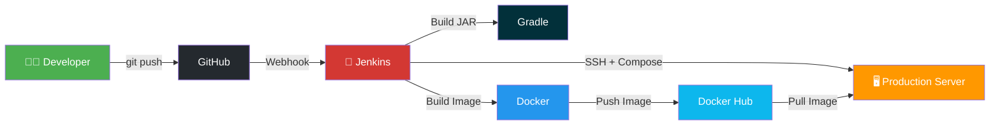
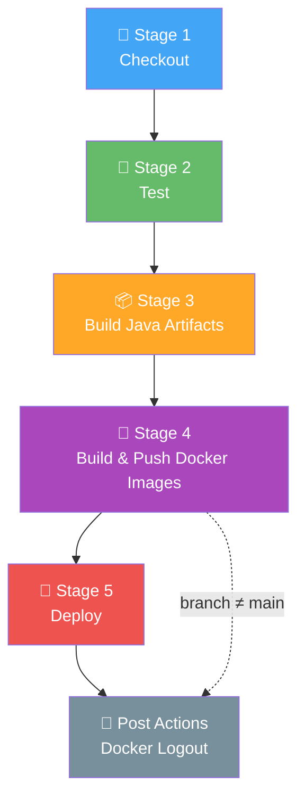
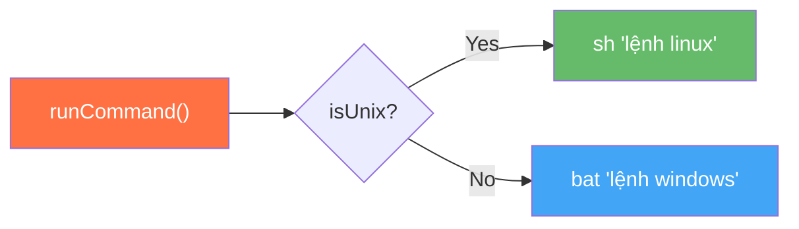
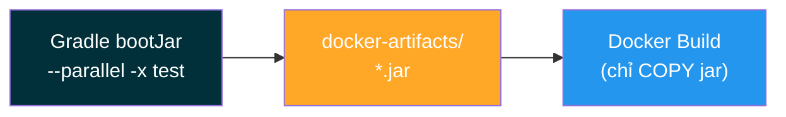
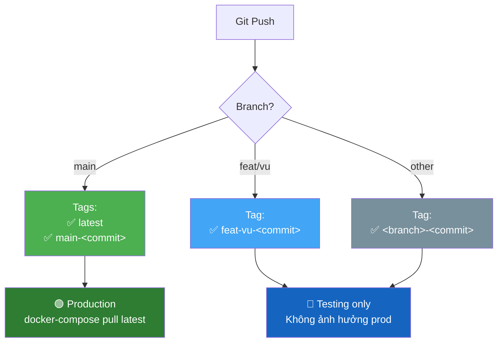
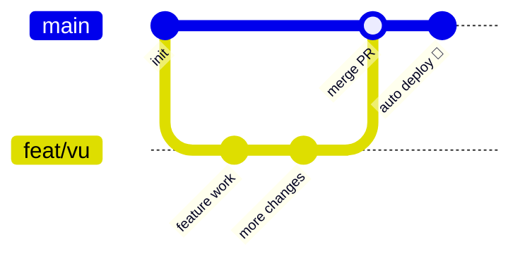
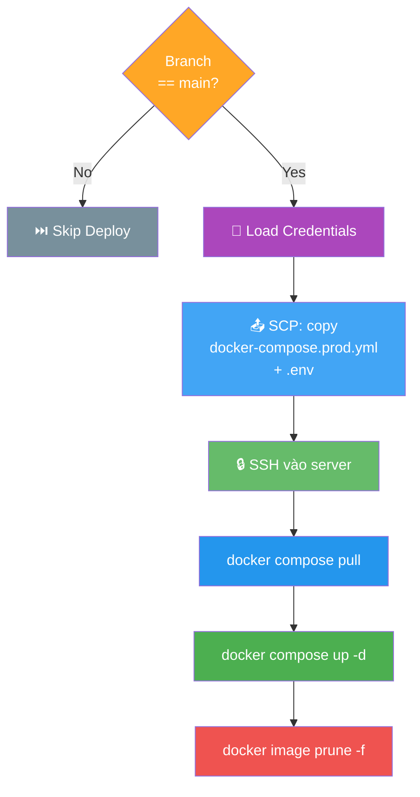
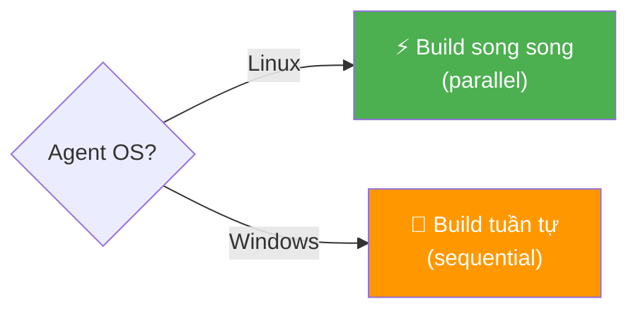
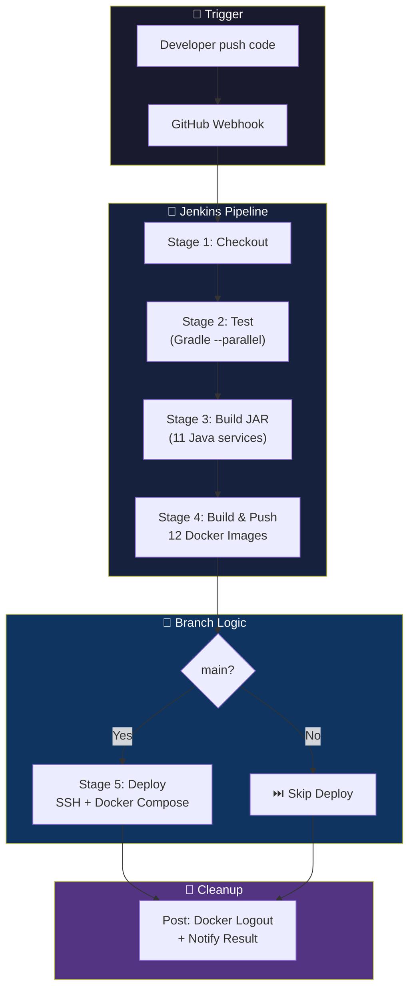

# Jenkins CI/CD Pipeline — Eatzy Microservices
## Nội dung thuyết trình 15 Slides — Môn DevOps

> Mỗi slide gồm 2 phần:
> - **📺 NỘI DUNG TRÊN SLIDE** — text ngắn gọn, hạn chế chữ, dùng để chiếu
> - **🎤 NỘI DUNG ĐỌC (Speaker Notes)** — nội dung chi tiết để người thuyết trình nói

---

## Slide 1: Trang bìa

### 📺 NỘI DUNG TRÊN SLIDE

# CI/CD Pipeline với Jenkins
### Dự án Eatzy Microservices

- Môn: DevOps
- Công cụ: Jenkins · Docker · GitHub · Gradle
- Kiến trúc: 12 Microservices (11 Java + 1 Python)

### 🎤 NỘI DUNG ĐỌC

> Xin chào mọi người, hôm nay mình sẽ trình bày về cách xây dựng CI/CD Pipeline bằng Jenkins cho dự án Eatzy Microservices. Đây là một hệ thống đặt đồ ăn gồm 12 microservices — 11 service viết bằng Java Spring Boot và 1 service AI viết bằng Python. Mình sẽ đi qua toàn bộ luồng từ khi developer push code lên GitHub cho đến khi ứng dụng được deploy lên production server.

---

## Slide 2: Công cụ & Công nghệ sử dụng

### 📺 NỘI DUNG TRÊN SLIDE

| Công cụ | Vai trò |
|---|---|
| **Jenkins** | CI/CD server, điều phối pipeline |
| **GitHub** | Source code repository + Webhook |
| **Gradle** | Build tool cho Java services |
| **Docker** | Container hóa tất cả services |
| **Docker Hub** | Registry lưu trữ Docker images |
| **SSH + SCP** | Deploy lên production server |
| **Docker Compose** | Orchestration trên production |

### 🎤 NỘI DUNG ĐỌC

> Đầu tiên mình giới thiệu các công cụ chính. **Jenkins** đóng vai trò là CI/CD server — nơi điều phối toàn bộ pipeline từ build đến deploy. **GitHub** là nơi lưu trữ source code, đồng thời gửi webhook tới Jenkins mỗi khi có code mới được push. **Gradle** là build tool dùng để compile và đóng gói Java services thành file JAR. **Docker** dùng để container hóa tất cả services, và **Docker Hub** là nơi lưu trữ các Docker images sau khi build. Cuối cùng, việc deploy sử dụng **SSH/SCP** để truyền file và chạy lệnh trên production server, còn **Docker Compose** dùng để khởi chạy các containers trên server.

---

## Slide 3: Kiến trúc tổng quan hệ thống CI/CD

### 📺 NỘI DUNG TRÊN SLIDE



### 🎤 NỘI DUNG ĐỌC

> Đây là kiến trúc tổng quan. Luồng bắt đầu từ developer push code lên GitHub. GitHub sẽ gửi webhook đến Jenkins để trigger pipeline. Jenkins sử dụng Gradle để build file JAR, sau đó dùng Docker để đóng gói thành image và push lên Docker Hub. Nếu build trên branch main, Jenkins sẽ SSH vào production server, chạy docker compose pull để kéo image mới nhất từ Docker Hub, rồi khởi động lại các services. Toàn bộ luồng này tự động, developer chỉ cần push code.

---

## Slide 4: Jenkins Multibranch Pipeline

### 📺 NỘI DUNG TRÊN SLIDE

**Declarative Pipeline** — định nghĩa trong `Jenkinsfile`

```groovy
pipeline {
    agent any
    options {
        timeout(time: 60, unit: 'MINUTES')
        disableConcurrentBuilds()
        buildDiscarder(logRotator(numToKeepStr: '10'))
    }
    stages { ... }
    post { ... }
}
```

| Option | Ý nghĩa |
|---|---|
| `timeout(60 min)` | Tự hủy build nếu chạy quá 60 phút |
| `disableConcurrentBuilds()` | Không chạy song song cùng 1 job |
| `buildDiscarder(10)` | Chỉ giữ 10 build gần nhất |

### 🎤 NỘI DUNG ĐỌC

> Dự án sử dụng **Declarative Pipeline**, được định nghĩa trong file `Jenkinsfile` nằm ngay trong repository. Jenkins dùng kiểu **Multibranch Pipeline** — nghĩa là Jenkins tự động phát hiện tất cả các branch trên GitHub và tạo job riêng cho từng branch. Pipeline có một số options quan trọng: `timeout 60 phút` để tự hủy build nếu bị treo quá lâu; `disableConcurrentBuilds` để tránh nhiều build chồng lên nhau gây lỗi, đặc biệt khi Docker Desktop đang build image; và `buildDiscarder` chỉ giữ lại 10 build gần nhất để tiết kiệm dung lượng.

---

## Slide 5: Tổng quan các Stage trong Pipeline

### 📺 NỘI DUNG TRÊN SLIDE



### 🎤 NỘI DUNG ĐỌC

> Pipeline gồm 5 stage chính và phần post actions. **Stage 1 — Checkout**: lấy source code từ GitHub. **Stage 2 — Test**: chạy unit test bằng Gradle. **Stage 3 — Build Java Artifacts**: compile và đóng gói 11 Java services thành file JAR. **Stage 4 — Build & Push Docker Images**: đóng gói tất cả 12 services thành Docker image và push lên Docker Hub. **Stage 5 — Deploy**: chỉ chạy trên branch `main`, SSH vào server và khởi chạy containers mới. Cuối cùng là **Post Actions** — luôn chạy bất kể pipeline thành công hay fail, dùng để logout Docker Hub và báo kết quả.

---

## Slide 6: Stage 1 — Checkout

### 📺 NỘI DUNG TRÊN SLIDE

**Mục đích**: Lấy source code từ GitHub về Jenkins workspace

```groovy
checkout scm
```

- Multibranch Pipeline tự xác định branch đang build
- Biến môi trường: `BRANCH_NAME`, `GIT_BRANCH`, `GIT_COMMIT`

**Xử lý cross-platform:**
```groovy
runCommand(
    'chmod +x gradlew',                    // Linux
    'if exist gradlew.bat echo Windows...' // Windows
)
```

### 🎤 NỘI DUNG ĐỌC

> Stage đầu tiên là Checkout — Jenkins sẽ clone source code từ GitHub về workspace. Trong Multibranch Pipeline, Jenkins tự biết branch nào đang build thông qua các biến môi trường như `BRANCH_NAME` và `GIT_COMMIT`. Một điểm đáng chú ý là pipeline phải hỗ trợ cả Windows và Linux agent. Trên Linux, file `gradlew` cần được cấp quyền executable bằng `chmod +x`. Trên Windows thì dùng `gradlew.bat` nên không cần chmod. Pipeline dùng helper function `runCommand()` để tự động chọn lệnh phù hợp với từng môi trường.

---

## Slide 7: Helper Function — runCommand()

### 📺 NỘI DUNG TRÊN SLIDE

**Vấn đề**: Pipeline phải chạy được trên cả Linux & Windows

```groovy
def runCommand(String unixCmd, String winCmd = null) {
    if (isUnix()) {
        sh unixCmd
    } else {
        bat winCmd ?: unixCmd
    }
}
```



### 🎤 NỘI DUNG ĐỌC

> Helper function `runCommand()` là giải pháp để pipeline chạy trên cả hai môi trường. Nó nhận 2 tham số: lệnh Linux và lệnh Windows. Khi chạy, nó kiểm tra agent hiện tại là Linux hay Windows rồi gọi lệnh tương ứng. Nếu không truyền lệnh Windows riêng, nó sẽ dùng luôn lệnh Linux. Điều này rất quan trọng vì nếu không có helper này, khi Jenkins agent là Windows mà pipeline gọi `sh`, sẽ gặp lỗi `Cannot run program "sh"`. Toàn bộ pipeline dùng `runCommand` ở mọi nơi cần chạy lệnh shell.

---

## Slide 8: Stage 2 — Test

### 📺 NỘI DUNG TRÊN SLIDE

**Lệnh test:**
```bash
./gradlew test --parallel --continue
```

**Xử lý khi test fail:**
```groovy
catchError(buildResult: 'SUCCESS', stageResult: 'UNSTABLE')
```

| Tình huống | buildResult | stageResult |
|---|---|---|
| Test pass | ✅ SUCCESS | ✅ SUCCESS |
| Test fail | ✅ SUCCESS | ⚠️ UNSTABLE |

**JUnit Report:**
```groovy
junit allowEmptyResults: true,
     testResults: '**/build/test-results/test/*.xml'
```

### 🎤 NỘI DUNG ĐỌC

> Stage Test chạy Gradle test với flag `--parallel` để test song song các module và `--continue` để không dừng khi 1 module fail. Điểm đặc biệt là stage này được bọc trong `catchError` — nếu test fail, stage sẽ được đánh dấu `UNSTABLE` (cảnh báo) nhưng pipeline vẫn tiếp tục build và push image. Đây là cấu hình tạm thời vì dự án chưa có đầy đủ test suite. Khi test suite đã ổn định và đáng tin cậy, nên bỏ `catchError` để pipeline fail hard khi test fail. Pipeline cũng publish JUnit report với `allowEmptyResults: true` để không fail khi có service chưa viết test.

---

## Slide 9: Stage 3 — Build Java Artifacts

### 📺 NỘI DUNG TRÊN SLIDE

**11 Java Services được build:**

```text
eatzy-discovery-server    eatzy-config-server
eatzy-api-gateway         eatzy-auth-service
eatzy-restaurant-service  eatzy-order-service
eatzy-communication-service  eatzy-cart-service
eatzy-payment-service     eatzy-interaction-service
eatzy-system-config-service
```



> ⚡ Build 1 lần trên Jenkins agent → Docker chỉ cần COPY file JAR

### 🎤 NỘI DUNG ĐỌC

> Stage này build tất cả 11 Java services bằng lệnh `bootJar` của Gradle. Flag `--parallel` giúp build song song các module, và `-x test` bỏ qua test vì đã chạy ở stage trước. Sau khi build xong, pipeline copy tất cả file JAR vào thư mục `docker-artifacts/`. Lý do tách bước build artifact ra khỏi Docker build là: trước đây mỗi Dockerfile tự compile Java bằng Gradle, rất chậm và dễ lỗi trên Docker Desktop Windows. Bằng cách build JAR 1 lần trên Jenkins agent, Dockerfile chỉ cần COPY file JAR vào image — nhanh hơn rất nhiều, không phải tải Gradle wrapper 11 lần trong container, và tránh được lỗi BuildKit cache trên Windows.

---

## Slide 10: Stage 4 — Build & Push Docker Images

### 📺 NỘI DUNG TRÊN SLIDE

**Dockerfile Java service:**
```dockerfile
FROM eclipse-temurin:17-jre-alpine
WORKDIR /app
COPY docker-artifacts/eatzy-auth-service.jar app.jar
EXPOSE 8081
ENTRYPOINT ["java", "-jar", "app.jar"]
```

**Dockerfile AI service (Python):**
```dockerfile
FROM python:3.12-slim
WORKDIR /app
COPY eatzy-ai-service/requirements.txt .
RUN pip install --no-cache-dir -r requirements.txt
COPY eatzy-ai-service/ .
CMD ["uvicorn", "main:app", "--host", "0.0.0.0", "--port", "8089"]
```

> 📦 12 images = 11 Java + 1 Python

### 🎤 NỘI DUNG ĐỌC

> Stage này build và push Docker images cho tất cả 12 services. Với Java services, Dockerfile rất đơn giản — chỉ dùng base image `eclipse-temurin:17-jre-alpine` (nhẹ, chỉ có JRE), copy file JAR đã build ở stage trước, và set entrypoint. Với AI service viết bằng Python, Dockerfile phức tạp hơn — cần cài dependencies từ `requirements.txt` rồi copy source code vào. Pipeline login Docker Hub bằng credentials được lưu trong Jenkins, sử dụng `withCredentials` để đảm bảo password không bị in ra log. Sau đó build và push image cho từng service.

---

## Slide 11: Docker Image Tagging Strategy

### 📺 NỘI DUNG TRÊN SLIDE



| Branch | Ví dụ tag |
|---|---|
| `main` | `latest`, `main-66dea5b` |
| `feat/vu` | `feat-vu-66dea5b` |

### 🎤 NỘI DUNG ĐỌC

> Chiến lược tagging rất quan trọng trong CI/CD. Khi build trên branch `main`, pipeline tạo 2 tag: `latest` để production compose file luôn pull được image mới nhất, và `main-<commit>` để truy vết image được build từ commit nào, phục vụ debug và rollback. Khi build trên feature branch, chỉ tạo 1 tag dạng `feat-vu-66dea5b` — branch name được "sanitize" bằng hàm `dockerSafeTag()` để thay thế ký tự đặc biệt như dấu `/` thành `-`. Điều này đảm bảo feature branch không bao giờ ghi đè tag `latest`, tránh ảnh hưởng production.

---

## Slide 12: Branching Strategy & Hành vi Pipeline

### 📺 NỘI DUNG TRÊN SLIDE



| Branch | Test | Build | Push Image | Deploy |
|---|:---:|:---:|:---:|:---:|
| `main` | ✅ | ✅ | ✅ | ✅ 🚀 |
| `feat/*` | ✅ | ✅ | ✅ | ❌ |
| Khác | ✅ | ✅ | ✅ | ❌ |

> 🔒 Deploy bị chặn bởi: `when { expression { isMainBranch() } }`

### 🎤 NỘI DUNG ĐỌC

> Pipeline xử lý khác nhau tùy branch. Tất cả branch đều được test, build JAR, build Docker image và push lên Docker Hub — đảm bảo mọi code đều được kiểm tra. Tuy nhiên, **chỉ branch `main` mới được deploy** lên production. Điều kiện được kiểm soát bằng hàm `isMainBranch()` trong block `when`. Khi developer push lên feature branch, Jenkins vẫn chạy đầy đủ pipeline trừ bước deploy — giúp phát hiện lỗi sớm. Khi merge vào main thông qua Pull Request, pipeline chạy lại và lần này sẽ deploy lên server. Log sẽ hiện `Stage "Deploy" skipped due to when conditional` khi build feature branch.

---

## Slide 13: Stage 5 — Deploy lên Production

### 📺 NỘI DUNG TRÊN SLIDE



**5 Credentials cần thiết:**

| ID | Loại | Mục đích |
|---|---|---|
| `server-ssh-key` | SSH Key | SSH vào server |
| `server-ip` | Secret text | IP server |
| `server-port` | Secret text | SSH port |
| `dockerhub-user` | Secret text | Docker Hub user |
| `env-file` | Secret file | File `.env` production |

### 🎤 NỘI DUNG ĐỌC

> Stage Deploy chỉ chạy trên branch `main`. Đầu tiên, Jenkins load 5 credentials từ Jenkins Credentials Store — bao gồm SSH key, IP server, port, Docker Hub username và file `.env` chứa biến môi trường production. Sau đó pipeline dùng SCP để copy file `docker-compose.prod.yml` và `.env` lên server. Tiếp theo SSH vào server và chạy 3 lệnh: `docker compose pull` để kéo image mới nhất từ Docker Hub, `docker compose up -d` để khởi chạy containers ở chế độ background, và `docker image prune -f` để dọn dẹp image cũ tiết kiệm dung lượng. Toàn bộ quá trình tự động, không cần can thiệp thủ công.

---

## Slide 14: Xử lý Windows vs Linux & Troubleshooting

### 📺 NỘI DUNG TRÊN SLIDE

**Build Docker song song vs tuần tự:**



**Lỗi thường gặp trên Windows:**

| Lỗi | Nguyên nhân |
|---|---|
| `Cannot run program "sh"` | Agent Windows, thiếu `runCommand` |
| `COPY *.jar: not found` | Thiếu `call` trước `gradlew.bat` |
| `meta.db input/output error` | Docker Desktop lỗi storage |
| `zip END header not found` | Gradle cache corrupt trong Docker |

### 🎤 NỘI DUNG ĐỌC

> Một thách thức lớn là pipeline phải chạy trên cả Linux và Windows. Trên Linux, Docker images được build song song — nhanh hơn đáng kể. Nhưng trên Windows với Docker Desktop chạy qua WSL2, build song song rất hay gặp lỗi BuildKit storage như `metadata_v2.db input/output error`. Vì vậy pipeline tự phát hiện OS và chuyển sang build tuần tự trên Windows. Một lỗi kinh điển khác trên Windows là thiếu keyword `call` trước `gradlew.bat` — trong batch script, khi gọi một file `.bat` khác mà không có `call`, script cha sẽ dừng ngay lập tức, các lệnh copy JAR sau đó không chạy, dẫn đến Docker build fail vì không tìm thấy file JAR.

---

## Slide 15: Tổng kết & Diagram toàn bộ Pipeline

### 📺 NỘI DUNG TRÊN SLIDE



**Tóm tắt:**
- ✅ **Tự động hoàn toàn**: Push code → Build → Test → Deploy
- ✅ **12 Microservices**: 11 Java (Spring Boot) + 1 Python (AI)
- ✅ **Branching an toàn**: Feature branch không ảnh hưởng production
- ✅ **Cross-platform**: Hỗ trợ cả Linux & Windows agent
- ✅ **Bảo mật**: Credentials quản lý bởi Jenkins, Docker logout sau mỗi build

### 🎤 NỘI DUNG ĐỌC

> Tổng kết lại, pipeline CI/CD của Eatzy Microservices được thiết kế tự động hoàn toàn — từ khi developer push code lên GitHub, Jenkins nhận webhook và chạy qua 5 stage: Checkout, Test, Build Artifact, Build & Push Docker Image, và Deploy. Pipeline hỗ trợ cross-platform cho cả Linux và Windows agent, xử lý 12 microservices cùng lúc, và đảm bảo an toàn bằng cách chỉ deploy branch `main`. Credentials được quản lý tập trung bởi Jenkins Credentials Store và Docker luôn logout sau mỗi build. Chiến lược tagging giúp truy vết image theo commit và bảo vệ production khỏi code chưa sẵn sàng. Cảm ơn mọi người đã lắng nghe, mình sẵn sàng nhận câu hỏi.
